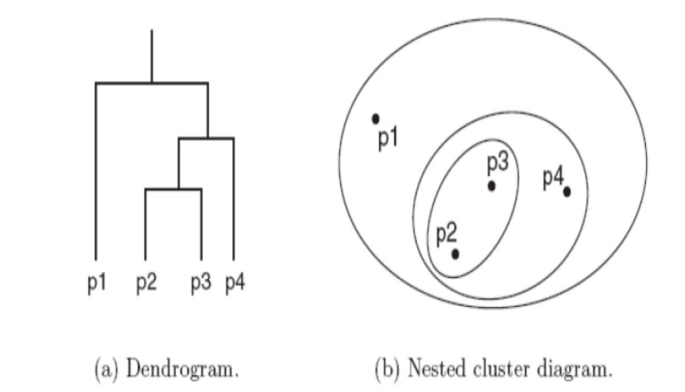
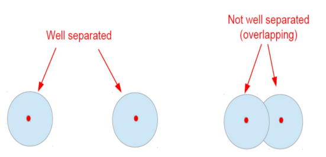
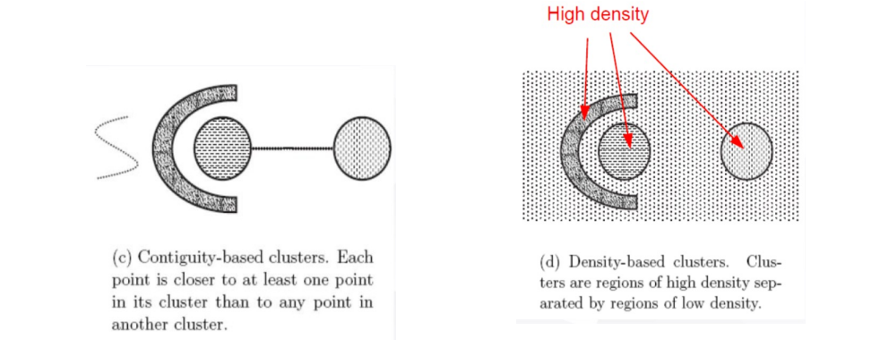
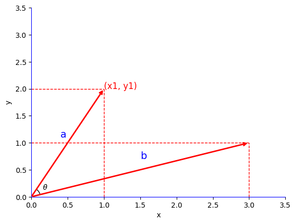

# 8.1 基本概念

## 8.1.1 什么是聚类？

在无监督学习中，需要发现数据中分组聚集的结构，并根据数据中样本与样本之间的距离或相似度，将样本划分为若干组/类/簇（cluster）


<mark style="color:orange;">**划分的原则**</mark>：<mark style="color:red;">**类内样本距离小，类间样本距离大**</mark>


### 一、聚类的类型

聚类的结果是产生一组聚类的集合

- **基于划分的聚类**（<mark style="color:orange;">**无嵌套**</mark>）：每个样本仅属于一个簇
- **基于层次的聚类**（<mark style="color:orange;">**嵌套**</mark>）：树形的聚类结构，簇之间存在嵌套




聚类中的簇集合还有一些其它的区别，包括：

- <mark style="color:purple;">**独占**</mark>和<mark style="color:purple;">**非独占**</mark>：非独占的簇中，样本可以属于多个簇
- <mark style="color:purple;">**模糊**</mark>和<mark style="color:purple;">**非模糊**</mark>
  - 模糊的簇表现为$$\sum p=1$$，而非模糊的簇中概率非0即1
  - 概率聚类有相似的特性
- <mark style="color:purple;">**部分**</mark>和<mark style="color:purple;">**完备**</mark>：在非完备的场景中，只聚类部分数据
- <mark style="color:purple;">**异质**</mark>和<mark style="color:purple;">**同质**</mark>：簇的大小、形状和密度是否有很大差别


### 二、簇的类型

#### 1、基于中心的簇



簇内的点和其“中心”较为相近（或相似），和其他簇的“中心”较远，这样的一组样本形成的簇




簇**中心**的表示：

- **质心**：簇内所有点的平均
- **中值点**：簇内最有代表性的点




#### 2、基于连续性和基于密度的簇

- **<mark style="color:orange;">连续性</mark>**：相比其他任何簇的点，每个点都至少和所属簇的某一个点更近
- **<mark style="color:orange;">密度</mark>**：簇是由高密度的区域形成的，簇之间是一些低密度的区域



#### 3、基于概念的簇



同一个簇共享某种性质，这个性质是从整个集合推导出来的



这种簇通常较难分辨，因为它一般不是基于中心/密度的


### 三、聚类分析的三要素

- **如何定义样本点之间的**<mark style="color:orange;">**远近**</mark>
  - <mark style="color:red;">**距离函数**</mark>
- **如何评价聚类得到的簇的**<mark style="color:orange;">**质量**</mark>
  - <mark style="color:red;">**评价函数**</mark>
- **如何获得聚类的簇**
  - 怎样表示簇
  - 怎样设计划分和优化算法
  - 算法何时停止


## 8.1.2 数据预处理

假设有n个样本，每一个有d个特征，则可以表示为一个n行d列的特征矩阵。对于这样的样本特征矩阵，有一些常见的数据预处理步骤：

### 一、标准化（StandardScaler）



将输入特征的<mark style="color:purple;">**均值**</mark>变为0，<mark style="color:purple;">**方差**</mark>变为1



```python
from sklearn.preprocessing import StandardScaler

# 构造输入特征的标准化器
ss_X = StandardScaler()

# 分别对训练和测试数据的特征进行标准化处理
X_train = ss_X.fit_transform(X_train)
X_test = ss_X.transform(X_test)
```

对于每一个维度的特征，有：
$$
\begin{align}
&x_i^`=\frac{x_i-\mu}{\sigma} \nonumber\\
\\
&\mu = \frac1N\sum_{i=0}^Nx_i\\ 
\\
&\sigma = \sqrt{\frac1{N-1}\left(\sum_{i=1}^Nx_i-\mu\right)^2}
\end{align}
$$


### 二、区间缩放（Min-Max Scaling）



将特征的<mark style="color:purple;">**取值范围**</mark>缩放到$$[0,1]$$​区间

有时也会缩放到$$[-1,1]$$




- 对非常小的标准偏差的特征鲁棒性更强
- 能够在系数数据中保留零条目


### 三、归一化（Normalization）



对于样本的不同特征，将它们缩放同样的单位向量



即将样本的模的长度变为单位1：
$$
\begin{align}
\boldsymbol x_i^` &= \frac{\boldsymbol x_i}{\Vert\boldsymbol x_i\Vert_2} \nonumber\\
\\
&= \frac{\boldsymbol x_i}{\sqrt{\sum\limits_{d=1}^D x_{id}^2}}
\end{align}
$$
在求欧氏距离和文本特征时常用到


## 8.1.3 距离度量函数

一个距离度量函数应当满足的特征：

- <mark style="color:orange;">**非负性**</mark>：$$dist(\boldsymbol x_i,\boldsymbol x_j)\geq 0$$
- <mark style="color:orange;">**不可分的同一性**</mark>：$$dist(\boldsymbol x_i,\boldsymbol x_j) = 0\ if\ \boldsymbol x_i=\boldsymbol x_j$$
- <mark style="color:orange;">**对称性**</mark>：$$dist(\boldsymbol x_i,\boldsymbol x_j) = dist(\boldsymbol x_j,\boldsymbol x_i)$$
- <mark style="color:orange;">**三角不等式**</mark>：$$dist(\boldsymbol x_i,\boldsymbol x_j) \leq dist(\boldsymbol x_i,\boldsymbol x_k) + dist(\boldsymbol x_k,\boldsymbol x_j)$$


### 一、闵可夫斯基（Minkowski）距离

$$
dist(\boldsymbol x_i,\boldsymbol x_j)=\left(\sum_{d=1}^D\vert x_{id}-x_{jd}\vert^p\right)^\frac1p
$$

当$$p=2$$时，为<mark style="color:purple;">**欧氏距离**</mark>：
$$
dist(\boldsymbol x_i,\boldsymbol x_j)=\sqrt{\sum_{d=1}^D( x_{id}-x_{jd})^2}
$$
当$$p=1$$时，为<mark style="color:purple;">**曼哈顿距离**</mark>：
$$
dist(\boldsymbol x_i,\boldsymbol x_j)=\sum_{d=1}^D\vert x_{id}-x_{jd}\vert
$$


- 对样本特征的<mark style="color:orange;">**旋转和平移变换不敏感**</mark>
- 对样本特征的<mark style="color:orange;">**数值尺度敏感**</mark>
- 当特征值尺度不一致时，需要进行标准化操作


### 二、余弦相似度



将两个变量看作高维空间的两个向量，通过夹角余弦评估其相似度：
$$
\begin{align}
\cos(\theta) &= \frac{a\cdot b}{\Vert a\Vert\times\Vert b\Vert} \nonumber \\
\\
&= \frac{(x_1,y_1)\cdot(x_2,y_2)}{\sqrt{x_1^2+y_1^2}\times\sqrt{x_2^2+y_2^2}}\\
\\
&= \frac{x_1x_2+y_1y_2}{\sqrt{x_1^2+y_1^2}\times\sqrt{x_2^2+y_2^2}}
\end{align}
$$

进而有：
$$
\cos(\theta)=\frac{\sum\limits_{i=1}^n(x_i\times y_i)}{\sqrt{\sum\limits_{i=1}^nx_i^2}\times\sqrt{\sum\limits_{i=1}^ny_i^2}}
$$

### 三、相关系数

定义变量$$\boldsymbol x_i,\boldsymbol x_j$$的相关系数为：
$$
\begin{align}
r(\boldsymbol x_i,\boldsymbol x_j) &= \frac{cov(\boldsymbol x_i,\boldsymbol x_j)}{\sigma_{x_i}\sigma_{x_j}}\nonumber \\
\\
&=\frac{\mathbb{E}\left[\left(\boldsymbol{x}_i-\boldsymbol{\mu}_i\right)\left(\boldsymbol{x}_i-\boldsymbol{\mu}_j\right)\right]}{\sigma_{\boldsymbol{x}_i} \sigma_{\boldsymbol{x}_j}}\\
\\
&=\frac{\sum\limits_{k=1}^D(x_{ik-\mu_{ik}})(x_{jk}-\mu_{jk})}{\sqrt{\sum\limits_{k=1}^D(x_{ik}-\mu_{ik})^2\sum\limits_{j=1}^D(x_{jk}-\mu_{jk})^2}}
\end{align}
$$


当对数据做中心化后，相关系数等于余弦相似度




## 8.1.4 聚类性能评价指标


## 绘图代码

```python
import numpy as np
import matplotlib.pyplot as plt
from matplotlib.patches import Arc
from matplotlib.transforms import Bbox, IdentityTransform, TransformedBbox

class AngleAnnotation(Arc):
    """
    Draws an arc between two vectors which appears circular in display space.
    """
    def __init__(self, xy, p1, p2, size=75, unit="points", ax=None,
                 text="", textposition="inside", text_kw=None, **kwargs):
        """
        Parameters
        ----------
        xy, p1, p2 : tuple or array of two floats
            Center position and two points. Angle annotation is drawn between
            the two vectors connecting *p1* and *p2* with *xy*, respectively.
            Units are data coordinates.

        size : float
            Diameter of the angle annotation in units specified by *unit*.

        unit : str
            One of the following strings to specify the unit of *size*:

            * "pixels": pixels
            * "points": points, use points instead of pixels to not have a
              dependence on the DPI
            * "axes width", "axes height": relative units of Axes width, height
            * "axes min", "axes max": minimum or maximum of relative Axes
              width, height

        ax : `matplotlib.axes.Axes`
            The Axes to add the angle annotation to.

        text : str
            The text to mark the angle with.

        textposition : {"inside", "outside", "edge"}
            Whether to show the text in- or outside the arc. "edge" can be used
            for custom positions anchored at the arc's edge.

        text_kw : dict
            Dictionary of arguments passed to the Annotation.

        **kwargs
            Further parameters are passed to `matplotlib.patches.Arc`. Use this
            to specify, color, linewidth etc. of the arc.

        """
        self.ax = ax or plt.gca()
        self._xydata = xy  # in data coordinates
        self.vec1 = p1
        self.vec2 = p2
        self.size = size
        self.unit = unit
        self.textposition = textposition

        super().__init__(self._xydata, size, size, angle=0.0,
                         theta1=self.theta1, theta2=self.theta2, **kwargs)

        self.set_transform(IdentityTransform())
        self.ax.add_patch(self)

        self.kw = dict(ha="center", va="center",
                       xycoords=IdentityTransform(),
                       xytext=(0, 0), textcoords="offset points",
                       annotation_clip=True)
        self.kw.update(text_kw or {})
        self.text = ax.annotate(text, xy=self._center, **self.kw)

    def get_size(self):
        factor = 1.
        if self.unit == "points":
            factor = self.ax.figure.dpi / 72.
        elif self.unit[:4] == "axes":
            b = TransformedBbox(Bbox.unit(), self.ax.transAxes)
            dic = {"max": max(b.width, b.height),
                   "min": min(b.width, b.height),
                   "width": b.width, "height": b.height}
            factor = dic[self.unit[5:]]
        return self.size * factor

    def set_size(self, size):
        self.size = size

    def get_center_in_pixels(self):
        """return center in pixels"""
        return self.ax.transData.transform(self._xydata)

    def set_center(self, xy):
        """set center in data coordinates"""
        self._xydata = xy

    def get_theta(self, vec):
        vec_in_pixels = self.ax.transData.transform(vec) - self._center
        return np.rad2deg(np.arctan2(vec_in_pixels[1], vec_in_pixels[0]))

    def get_theta1(self):
        return self.get_theta(self.vec1)

    def get_theta2(self):
        return self.get_theta(self.vec2)

    def set_theta(self, angle):
        pass

    # Redefine attributes of the Arc to always give values in pixel space
    _center = property(get_center_in_pixels, set_center)
    theta1 = property(get_theta1, set_theta)
    theta2 = property(get_theta2, set_theta)
    width = property(get_size, set_size)
    height = property(get_size, set_size)

    # The following two methods are needed to update the text position.
    def draw(self, renderer):
        self.update_text()
        super().draw(renderer)

    def update_text(self):
        c = self._center
        s = self.get_size()
        angle_span = (self.theta2 - self.theta1) % 360
        angle = np.deg2rad(self.theta1 + angle_span / 2)
        r = s / 2
        if self.textposition == "inside":
            r = s / np.interp(angle_span, [60, 90, 135, 180],
                                          [3.3, 3.5, 3.8, 4])
        self.text.xy = c + r * np.array([np.cos(angle), np.sin(angle)])
        if self.textposition == "outside":
            def R90(a, r, w, h):
                if a < np.arctan(h/2/(r+w/2)):
                    return np.sqrt((r+w/2)**2 + (np.tan(a)*(r+w/2))**2)
                else:
                    c = np.sqrt((w/2)**2+(h/2)**2)
                    T = np.arcsin(c * np.cos(np.pi/2 - a + np.arcsin(h/2/c))/r)
                    xy = r * np.array([np.cos(a + T), np.sin(a + T)])
                    xy += np.array([w/2, h/2])
                    return np.sqrt(np.sum(xy**2))

            def R(a, r, w, h):
                aa = (a % (np.pi/4))*((a % (np.pi/2)) <= np.pi/4) + \
                     (np.pi/4 - (a % (np.pi/4)))*((a % (np.pi/2)) >= np.pi/4)
                return R90(aa, r, *[w, h][::int(np.sign(np.cos(2*a)))])

            bbox = self.text.get_window_extent()
            X = R(angle, r, bbox.width, bbox.height)
            trans = self.ax.figure.dpi_scale_trans.inverted()
            offs = trans.transform(((X-s/2), 0))[0] * 72
            self.text.set_position([offs*np.cos(angle), offs*np.sin(angle)])
            

# 创建一个新的图形和轴
fig, ax = plt.subplots()

# 设置矢量a的起点和终点
a_start = np.array([0, 0])
a_end = np.array([1, 2])

# 设置矢量b的起点和终点
b_start = np.array([0, 0])
b_end = np.array([3, 1])

# 绘制矢量a
ax.plot([0, 1], [2, 2], color='red', linestyle='--', linewidth=1)
ax.plot([1, 1], [0, 2], color='red', linestyle='--', linewidth=1)
ax.annotate('', xy=a_end, xytext=a_start, arrowprops=dict(facecolor='red', edgecolor='red', arrowstyle='->', lw=2))

# 绘制矢量b
ax.plot([0, 3], [1, 1], color='red', linestyle='--', linewidth=1)
ax.plot([3, 3], [0, 1], color='red', linestyle='--', linewidth=1)
ax.annotate('', xy=b_end, xytext=b_start, arrowprops=dict(facecolor='red', edgecolor='red', arrowstyle='->', lw=2))

# 标注点 (x1, y1)
ax.text(a_end[0], a_end[1], '(x1, y1)', fontsize=12, color='red')

# 标注矢量的名称和角度θ
ax.text((a_end[0] / 2)-0.1, (a_end[1] / 2)+0.1, 'a', fontsize=14, color='blue')
ax.text(b_end[0] / 2, (b_end[1] / 2)+0.2, 'b', fontsize=14, color='blue')
AngleAnnotation((0,0), b_end, a_end, ax=ax, size=35, text=r"$\theta$", textposition="outside")

# 设置坐标轴的范围和标签
ax.set_xlim(0, 3.5)
ax.set_ylim(0, 3.5)
ax.set_xlabel('x')
ax.set_ylabel('y')

# 绘制坐标轴
ax.spines['left'].set_position('zero')
ax.spines['left'].set_color('blue')
ax.spines['bottom'].set_position('zero')
ax.spines['bottom'].set_color('blue')
ax.spines['right'].set_color('none')
ax.spines['top'].set_color('none')

# 显示图形
plt.show()
```

