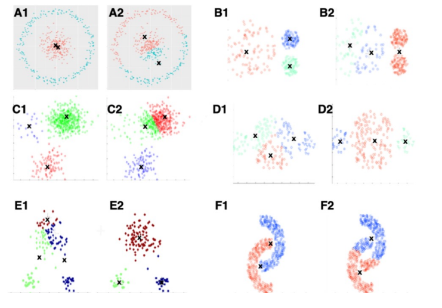

# 附 第八章作业

## 作业1

### 题目

下图给出6个数据集A-F分别用两种算法得到的聚类结果，其 中一种是K均值聚类。请问哪些最可能是K均值聚类的结果？如 果K均值聚类结果不够理想，建议采用哪种聚类算法?




### 解答

由于K-means聚类会表现为以簇中心的**中垂线分类**，因此很显然，上图中A2、B2、C2、D1、E1和F2属于使用K-means所得到的结果。


当K-means效果不佳时可以使用**高斯混合模型**等算法进行处理


## 作业2

### 题目

对如图所示的数据集，采用K均值聚类。设K=3，3个聚类中心分别为$\mu_1=(6.2,3.2)^T$（红色），$\mu_2=(6.6,3.7)^T$（绿色），$\mu_3=(6.5,3.0)^T$（蓝色）

请给出一次迭代后属于第一簇的样本及更新后的簇中心（保留两位小数）


### 解

计算每一个点到三个聚类中心的距离，并将该样本归类到距离最短的聚类中。使用代码计算如下：

```python
import numpy as np

X = np.array([
    [5.9, 3.2],
    [4.6, 2.9],
    [6.2, 2.8],
    [4.7, 3.2],
    [5.5, 4.2],
    [5.0, 3.0],
    [4.9, 3.1],
    [6.7, 3.1],
    [5.1, 3.8],
    [6.0, 3.0]
])

mu = np.array([
    [6.2, 3.2],
    [6.6, 3.7],
    [6.5, 3.0],
])

distances = np.linalg.norm(X[:, np.newaxis] - mu, axis=-1)

labels = np.argmin(distances, axis=-1)

new_mu = np.array([np.mean(X[labels == i], axis=0) for i in range(mu.shape[0])])

cluster1_samples = X[labels == 0]
new_mu_1 = new_mu[0]

print('属于第一簇的样本：')
print(cluster1_samples)
print(f'更新后的第一簇中心：{np.round(new_mu_1, 2)}')
```


得到结果：

属于第一簇的样本：
[[5.9 3.2]
 [4.6 2.9]
 [4.7 3.2]
 [5.0 3.0]
 [4.9 3.1]
 [5.1 3.8]
 [6.0  3.0]]

更新后的第一簇中心：[5.17 3.17]
