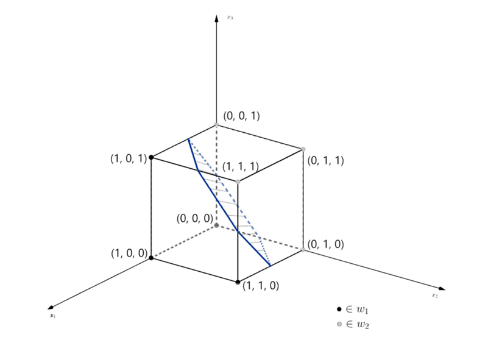

# 2.2 正态分布模式的贝叶斯分类器

### 2.2.1 M种模式类别的正态密度函数

具有M种模式类别的多变量正态密度函数为：

$$
p(x|\omega_i)=\frac{1}{(2\pi)^{\frac{n}{2}} (|C_i|)^{\frac{1}{2}}}e^{-\frac{1}{2}(x-m_i)^T C_i^{-1}(x-m_i)}
$$

其中，

* $n$为<mark style="color:purple;">**模式向量的维度**</mark>
* $m_i$为<mark style="color:orange;">**均值向量**</mark>
* $C_i$为<mark style="color:orange;">**协方差矩阵**</mark>
* $|C_i|$为协方差矩阵的行列式

$$
\begin{align} 
m_i &= E_i\{x\} 
\\ 
C_i &= E_i\{(x-m_i)(x-m_i)^T\}\ \  
\end{align}
$$

$E_i{x}$表示对类别属于$\omega_i$的模型的<mark style="color:purple;">**数学期望**</mark>

$C_i$是一个对称的正定阵，其对角线上的值代表元素的<mark style="color:purple;">**方差**</mark>，非对角线上为元素之间的<mark style="color:purple;">**协方差**</mark>。因此若元素之间全部<mark style="color:red;">**独立**</mark>时，多变量的正态概率密度函数可以简化为单个正态类密度函数的乘积。

由于类别 $\omega_i$的**判别函数**可以写为：

$$
d_i(x)=p(x|\omega_i)P(\omega_i),\ i=1,2,\dots,M
$$

对于正态密度函数，可以取对数方便计算，则将正态类密度函数带入，可得：

$$
\begin{align} d_i(x) &= \ln[p(x|\omega_i)] + \ln(P(\omega_i)) \\ &= -[\frac{n}{2}\ln(2\pi) + \frac{1}{2}\ln(|C_i|)] -\frac{1}{2}(x-m_i)^T C_i^{-1}(x-m_i) + \ln(P[\omega_i)] \\ &= \ln[P(\omega_i)] - \frac{1}{2}\ln(|C_i|) -\frac{1}{2}(x-m_i)^T C_i^{-1}(x-m_i) - \frac{n}{2}\ln(2\pi) \end{align}
$$

将其中与 $i$ 无关的项去除，即可得到<mark style="color:orange;">**正态分布模式的贝叶斯判别函数**</mark>：

$$
d_i(x) = \ln[P(\omega_i)] - \frac{1}{2}\ln(|C_i|) -\frac{1}{2}(x-m_i)^T C_i^{-1}(x-m_i),\ i=1,2,\dots,M
$$

#### 特点

* 判别函数是一个<mark style="color:purple;">**超二次曲面**</mark>
* 对于正态分布模式的贝叶斯判别器，将模式类别之间用一个二此判别界面分开，即可得到最优的分类结果

### 2.2.2 符合正态分布的二分类问题

#### 当 $C_1\neq C_2$ 时

假设两类模式的分布分别为$N(m_1,C_1)$和$N(m_2,C_2)$，则两类的判别函数分别为

$$
\begin{align} d_1(x) &= \ln P(\omega_1) - \frac{1}{2}\ln(|C_1|) -\frac{1}{2}(x-m_1)^T C_1^{-1}(x-m_1) \\ d_2(x) &= \ln P(\omega_2) - \frac{1}{2}\ln(|C_2|) -\frac{1}{2}(x-m_2)^T C_2^{-1}(x-m_2) \\ &d_1(x)-d_2(x) = \begin{cases} >0& x \in \omega_1\\ <0& x\in \omega_2 \end{cases} \end{align}
$$

* <mark style="color:orange;">**判别界面**</mark>$d_1(x)-d_2(x)=0$是x的<mark style="color:purple;">**二次型方程**</mark>
* 当x是二维模式时，判别界面为二次曲线。如圆、椭圆、双曲线、抛物线等

#### 当 $C_1=C_2=C$ 时


当两个模式的协方差矩阵相等时，意味着它们具有相同的方差和相同的线性关系。这可以解释为两个模式具有相似的变化模式，并且它们之间的相关性和方向相同。这种情况下，可以说这两个模式在数据中具有相似的特征和变化方式。


由于$C_1=C_2$，上式可以简化为：

$$
d_1(x) - d_2(x) = \ln P(\omega_1) - \ln P(\omega_2) + (m_1 - m_2)^TC^{-1}x - \frac{1}{2}(m_1^Tm_1 - m_2^Tm_2)C^{-1}
$$

* 判别界面为x的<mark style="color:purple;">**线性函数**</mark>，为一超平面
* 当x是二维时，判别界面为一条直线


**例**：两类问题且模式均为正态分布的实例$P(\omega_1) = P(\omega_2) = \frac{1}{2}$，求判别界面

计算均值向量和协方差矩阵，由大数定律：

$$
\begin{align} m_i &= E_i\{x\} \\&= \frac{1}{N}\sum_{j=1}^{N_i}x_{ij} \\ C_i &= E_i\{(x-m_i)(x-m_i)^T\} \\ &=\frac{1}{N}\sum_{j=1}^{N_i}(x_{ij}-m_i)(x_{ij}-m_i)^T \end{align}
$$

其中，$N_i$ 为 $\omega_i$ 中模式的数目，$x_{ij}$ 表示第i个类别中的第j个模式，可得：

$$
m_1 = \frac{1}{4}(3\ 1\ 1)^T \\ m_2 = \frac{1}{4}(1\ 3\ 3)^T
$$

$$
C_1 = C_2 = C = \frac{1}{16} \begin{pmatrix} 3 & 1 &1\\ 1 & 3 &-1\\ 1 & -1 & 3 \end{pmatrix} \\ \\ C^{-1} = 4 \begin{pmatrix} 2 &-1 & -1\\ -1 & 2 & 1\\ -1 & 1 & 2 \end{pmatrix}
$$

带入可得判别界面为：

$$
\begin{align} d_1(x) - d_2(x) &= \ln P(\omega_1) - \ln P(\omega_2) + (m_1 - m_2)^TC^{-1}x - \frac{1}{2}(m_1^Tm_1 - m_2^Tm_2)C^{-1} \\ &=8x_1-8x_2 -8x_3 + 4 = 0 \end{align}
$$



* 贝叶斯分类是基于统计规则的
* 若样本量较少，一般难以获得最有效果



### 2.2.3 朴素贝叶斯

在特征 $x=(x\_1,x\_2,x\_3,\dots,x\_d)$ 是多维向量时，朴素贝叶斯算法假设各个特征之间<mark style="color:purple;">**相互独立**</mark>

$$
p(x_1,x_2,\dots,x_d|\omega)= \prod^d p(x_i|\omega)
$$
