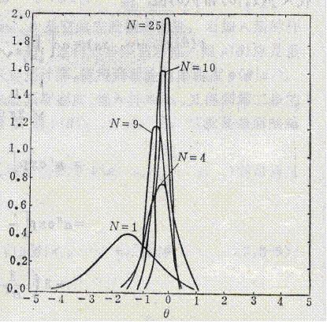

# 2.3 均值向量和协方差矩阵的参数估计

* 在贝叶斯分类器中，构造分类器需要知道类概率密度函数$$p(x|\omega\_i)$$
* 如果按先验知识已知其分布，则只需知道分布的参数即可
  * 例如：类概率密度是正态分布，它完全由其均值向量和协方差矩阵所确定

对均值向量和协方差矩阵的估计即为贝叶斯分类器中的一种<mark style="color:orange;">**参数估计**</mark>问题


**参数估计的两种方式**

- 一种是将参数作为非随机变量来处理，例如<mark style="color:purple;">**矩估计**</mark>就是一种非随机参数的估计
- 另一种是随机参数的估计，即**把这些参数看成是随机变量**，例如<mark style="color:purple;">**贝叶斯参数估计**</mark>



## 2.3.1 定义

### 均值

设模式的概率密度函数为$$p(x)$$，则均值的定义为：

$$
m = E(x) = \int_x xp(x)dx
$$

其中，$x=(x_1,x_2,\dots,x_n)^T$，$m=(m_1,m_2,\dots,m_n)^T$

由大数定律有，均值的估计量为：

$$
\hat{m} = \frac{1}{N}\sum^N_{j=1}x_j
$$

### 协方差

协方差矩阵为：

$$
C= \begin{pmatrix} c_{11} & c_{12} & \cdots & c_{1n}\\ c_{21} & c_{22} & \cdots & c_{2n}\\ \vdots & \vdots & \ddots & \vdots\\ c_{n1} & c_{n2} & \cdots & c_{nn} \end{pmatrix}
$$

其中，每个元素的定义为：

$$
\begin{align} 
c_{ij} &= E\{(x_i-m_i)(x_j-m_j)\} \nonumber
\\ 
&=\int_{-\infty}^{\infty}\int_{-\infty}^{\infty}(x_i-m_i)(x_j-m_j)p(x_i,x_j)dx_idx_j \nonumber
\end{align}
$$

其中，$$x_i$$、$$x_j$$和$$m_i$$、$$m_j$$分别为**x**、**m**的第i和j个分量。

将协方差矩阵写成向量的方式为：

$$
\begin{align} 
C&=E\{(x-m)(x-m)^T\} \nonumber
\\ 
&=E\{xx^T\} - mm^T \nonumber
\end{align}
$$

则根据大数定律，协方差的估计量可以写为：

$$
\hat{C} \approx \frac{1}{N}\sum^{N}_{k=1}(x_k-\hat{m})(x_k-\hat{m})^T
$$

## 2.3.2 迭代运算

### 均值

假设已经计算了N个样本的均值估计量，此时若新增一个样本，则新的估计量为：
$$
\begin{align}
\hat{m}(N+1) &= \frac{1}{N+1}\sum^{N+1}_{j=1}x_j \nonumber
\\
&= \frac{1}{N+1}\left[\sum_{j=1}^Nx_j + x_{N+1}\right] \nonumber
\\
&= \frac{1}{N+1}[N\hat{m}(N) + x_{N+1}]
\end{align}
$$
迭代的初始化取$$\hat{m}(1)=x_1$$

### 协方差

协方差与均值类似，当前已知
$$
\hat{C}(N)=\frac{1}{N}\sum^N_{j=1}x_jx_j^T - \hat{m}(N)\hat{m}^T(N)
$$
则新加入一个样本后：
$$
\begin{align}
\hat{C}(N+1) &= \frac{1}{N+1}\sum^{N+1}_{j=1}x_jx_j^T - \hat{m}(N+1)\hat{m}^T(N+1) \nonumber
\\
&= \frac{1}{N+1}\left[\sum_{j=1}^Nx_jx_j^T + x_{N+1}x_{N+1}^T\right] - \hat{m}(N+1)\hat{m}^T(N+1) \nonumber
\\
&=\frac{1}{N+1}[N\hat{C}(N) + N\hat{m}(N)\hat{m}^T(N) + x_{N+1}x_{N+1}^T] - \nonumber
\\
&\ \frac{1}{(N+1)^2}[N\hat{m}(N) + x_{N+1}][N\hat{m}(N) + x_{N+1}]^T
\end{align}
$$

由于$$\hat{m}(1)=x_1$$，因此有$$\hat{C}(1) = 0$$

## 2.3.4 贝叶斯学习

- 将概率密度函数的参数估计量看成是随机变量$$\theta$$，它可以是纯量、向量或矩阵
- 按这些估计量统计特性的先验知识，可以先粗略地预选出它们的密度函数
- 通过训练模式样本集$$\{x_i\}$$，利用贝叶斯公式设计一个迭代运算过程求出参数的后验概率密度$$p(\theta|x_i)$$
- 当后验概率密度函数中的随机变量$\theta$的确定性提高时，可获得较准确的估计量

具体而言，就是：
$$
p(\theta|x_1,\cdots,x_N) = \frac{p(x_N|\theta,x_1,\cdots,x_{N-1})p(\theta|x_1,\cdots,x_{N-1})}{p(x_N|x_1,\cdots,x_{N-1})}
$$
其中，<mark style="color:orange;">**先验概率**</mark>$$p(\theta|x_1,\cdots,x_{N-1})$$由迭代计算而来，而<mark style="color:orange;">**全概率**</mark>则由以下方式计算：
$$
p(x_N|x_1,\cdots,x_{N-1})=\int_xp(x_N|\theta,x_1,\cdots,x_{N-1})p(\theta|x_1,\cdots,x_{N-1})d\theta
$$
因此，实际上需要知道的就是初始的$$p(\theta)$$

### 单变量正态密度的均值学习



假设有一个模式样本集，其概率密度函数是单变量正态分布$$N(\theta,\sigma^2)$$，均值$$\theta$$待求，即：
$$
p(x|\theta)=\frac{1}{\sqrt{2\pi}\sigma}\exp{\left[-\frac{1}{2}\left(\frac{x-\theta}{\sigma^2}\right)^2\right]}
$$
给出N个训练样本$$\{x_1,x_2,\dots,x_N\}$$，用贝叶斯学习计算其均值估计量。

对于初始条件，设 $$p(\theta)=N(\theta_0,\sigma^2_0)$$，$$p(x_1|\theta)=N(\theta,\sigma^2)$$，由贝叶斯公式可得：
$$
\begin{align}
p(\theta|x_1) &= a\cdot p(x_1|\theta)p(\theta)\nonumber
\\
&= a\cdot \frac{1}{\sqrt{2\pi}\sigma}\exp{\left[-\frac{1}{2}\left(\frac{x-\theta}{\sigma^2}\right)^2\right]}\cdot \frac{1}{\sqrt{2\pi}\sigma_0}\exp{\left[-\frac{1}{2}\left(\frac{x-\theta_0}{\sigma_0^2}\right)^2\right]}\nonumber
\end{align}
$$
其中a是一定值。由贝叶斯法则有：
$$
p(\theta|x_1,\dots,x_N)=\frac{p(x_1,\dots,x_N|\theta)p(\theta)}{\int_\varphi p(x_1,\dots,x_N|\theta)p(\theta)d\theta}
$$

此处$$\phi$$表示整个模式空间，由于每一次迭代是逐个从样本子集中抽取，因此N次运算是<mark style="color:orange;">**独立的**</mark>，上式由此可以写成：
$$
\begin{align}
p(\theta|x_1,\dots,x_N)&=a\cdot\left\{\prod_{k=1}^Np(x_k|\theta)\right\}p(\theta)\nonumber
\\
&=a\cdot\left\{\prod_{k=1}^N\frac{1}{\sqrt{2\pi}\sigma}\exp{\left[-\frac{1}{2}\left(\frac{x_k-\theta}{\sigma^2}\right)^2\right]}\right\}\cdot\frac{1}{\sqrt{2\pi}\sigma_0}\exp{\left[-\frac{1}{2}\left(\frac{x-\theta_0}{\sigma_0^2}\right)^2\right]}\nonumber
\\
&=a^{'}\exp{\left[-\frac{1}{2}\left\{\sum_{k=1}^N\left(\frac{x_k-\theta}{\sigma}\right)^2\right\} + \left(\frac{x-\theta_0}{\sigma_0^2}\right)^2\right]}\nonumber
\\
&= a^{\prime \prime} \exp \left[-\frac{1}{2}\left\{\left(\frac{N}{\sigma^2}+\frac{1}{\sigma_0^2}\right) \theta^2-2\left(\frac{1}{\sigma^2} \sum_{k=1}^N x_k+\frac{\theta_0}{\sigma_0^2}\right) \theta\right\}\right]\nonumber
\end{align}
$$
将上式中所有与$$\theta$$无关的变量并入常数项$$a^{'}$$和$$a^{''}$$，则$$p(\theta|x_1,\dots,x_N)$$是$$\theta$$平方函数的指数集合，仍是<mark style="color:orange;">**正态密度函数**</mark>，写为$$N(\theta_N,\sigma_N^2)$$的形式，有：
$$
\begin{align}
p(\theta|x_1,\dots,x_N) &= \frac{1}{\sqrt{2\pi}\sigma_N}\exp{\left[-\frac{1}{2}\left(\frac{\theta-\theta_N}{\sigma_N}\right)^2\right]}\nonumber
\\
&= a^{'''}\exp{\left[-\frac{1}{2}\left(\frac{\theta^2}{\sigma^2_N}-2\frac{\theta_N\theta}{\sigma^2_N}\right)\right]}\nonumber
\end{align}
$$
上述两式相比较，可得：
$$
\begin{align}
\frac{1}{\sigma^2}&=\frac{N}{\sigma^2} + \frac{1}{\sigma^2_0}\nonumber
\\
\frac{\theta_N}{\sigma_N^2} &= \frac{1}{\sigma^2}\sum^N_{k=1}x_k + \frac{\theta_0}{\sigma_0^2}\nonumber
\\
&= \frac{N}{\sigma^2}\hat{m} + \frac{\theta_0}{\sigma_0^2}\nonumber
\end{align}
$$
解出$$\theta_N$$和$$\sigma_N$$，得：
$$
\theta_N = \frac{N\sigma_0^2}{N\sigma_0^2 + \sigma^2}\hat{m}_N + \frac{\sigma^2}{N\sigma_0^2 + \sigma^2}\nonumber
\\
\sigma_N^2 = \frac{\sigma_0^2\sigma^2}{N\sigma_0^2 + \sigma^2}\nonumber
$$
即根据对样本的观测，求得均值$$\theta$$的<mark style="color:purple;">**后验概率密度**</mark>$$p(\theta|x_i)$$为$$N(\theta_N,\sigma_N^2)$$，其中：

$$\theta_N$$是先验信息（$$\theta_0,\sigma_0^2,\sigma^2$$）与训练样本所给信息（$$N,\hat{m}$$）适当结合的结果，是N个训练样本对均值的<mark style="color:purple;">**先验估计**</mark>$$\theta_0$$的补充

$$\sigma_N^2$$是<mark style="color:orange;">**对这个估计的不确定性的度量**</mark>，随着N的增加而减少，因此当$$N\to\infin$$时，$$\sigma_N \to 0$$，代入上式可知只要$$\sigma_0\neq0$$，则当N数量足够大时，$$\theta_N$$趋于样本均值的估计量$$\hat{m}$$



