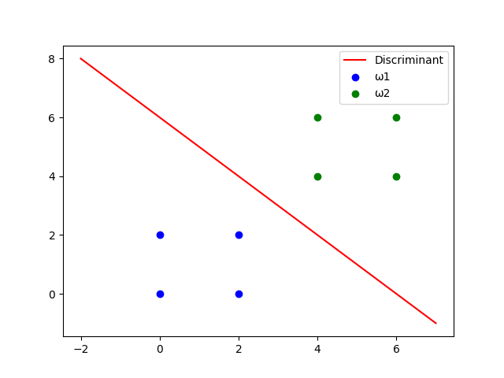

# 附 第二章作业

## 题目

设以下模式类别具有正态概率密度函数：  
$$
\omega_1 : \{(0\ 0)^T,(2\ 0)^T,(2\ 2)^T,(0\ 2)^T\}
\\
\omega_2 : \{(4\ 4)^T,(6\ 4)^T,(6\ 6)^T,(4\ 6)^T\}
$$
（1）设$$P(\omega_1)=P)\omega_2=\frac{1}{2}$$，求这两类模式之间的贝叶斯判别界面方程式。

（2）绘出判别界面。


### 解

#### （1）判别界面方程式

由
$$
m_i = \frac{1}{N}\sum_{j=1}^{N_i}x_{ij}
\\
C_i = \frac{1}{N}\sum_{j=1}^{N_i}(x_{ij}-m_i)(x_{ij}-m_i)^T
$$
得：
$$
\begin{align}
&m_1 =\frac14\sum_{j=1}^4x_{1j}= (1\ 1)^T \nonumber
\\
&m_2 =\frac14\sum_{j=1}^4x_{2j}= (5\ 5)^T
\\
&C_1 = \frac14\sum_{j=1}^4(x_{1j}-m_1)(x_{1j}-m_1)^T=
\begin{pmatrix}
1 & 0\\
0 & 1
\end{pmatrix}
\\
&C_2 = \frac14\sum_{j=1}^4(x_{2j}-m_2)(x_{2j}-m_2)^T=
\begin{pmatrix}
1 & 0\\
0 & 1
\end{pmatrix}
\\
&C^{-1}=
\begin{pmatrix}
1 & 0\\
0 & 1
\end{pmatrix}
\end{align}
$$
带入判别式有：
$$
\begin{align} 
d_1(x) - d_2(x) &= \ln P(\omega_1) - \ln P(\omega_2) + (m_1 - m_2)^TC^{-1}x  - \frac{1}{2}m_1^TC^{-1}m_1 + \frac{1}{2}m_2^TC^{-1}m_2 \nonumber
\\ 
&=-4x_1-4x_2 + 24 = 0 
\end{align}
$$

#### （2）绘图

绘制图像如下图所示：



### 附加

使用python实现：

```python
import numpy as np
import matplotlib.pyplot as plt

w1 = np.array([[0, 0], [2, 0], [2, 2], [0, 2]])
w2 = np.array([[4, 4], [6, 4], [6, 6], [4, 6]])

m1 = np.mean(w1, axis=0)
m2 = np.mean(w2, axis=0)

cov1 = np.cov(w1.T, bias=True)
cov2 = np.cov(w2.T, bias=True)

inv_cov1 = np.linalg.inv(cov1)
inv_cov2 = np.linalg.inv(cov2)

w = np.dot((m1 - m2), inv_cov1)
b = -0.5 * np.dot(m1, np.dot(inv_cov1, m1)) + 0.5 * np.dot(m2, np.dot(inv_cov2, m2))


def discriminant_function(_x):
    return -(w[0] * _x + b) / w[1]


x = np.linspace(-2, 7, 100)
plt.plot(x, discriminant_function(x), 'r-', label='Discriminant')
plt.scatter(w1[:, 0], w1[:, 1], c='blue', label='ω1')
plt.scatter(w2[:, 0], w2[:, 1], c='green', label='ω2')
plt.legend()

plt.show()
```

