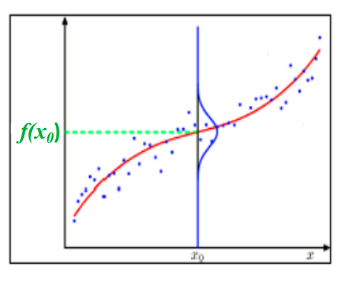

# 6.2 回归任务

## 6.2.1 最小均方误差（LMS）



最小均方误差在分类上属于判别函数



线性回归的任务：

- **输入**：N个<mark style="color:orange;">**独立同分布（i.i.d）**</mark>的训练样本$$(\mathbf{x}^i,y^i)\in X\times R$$，$$i=1,2,\dots,N$$
- **目标函数**：$$f\in \mathcal{F}$$
- **损失函数**：$$L(f;x,y) = (f(x)-y)^2$$
- **期望风险**：$$\int (f(x)-y)^2dP(x,y)$$
- 当$$f$$是线性函数，则最优化问题为：

$$
\min_\limits{\mathbf{w}} J(\mathbf{w}) = \sum_{i=1}^N(\mathbf{w}^T\mathbf{x}^i - y^i)^2
$$

也就是最小化<mark style="color:purple;">**经验风险**</mark>，在这里即为<mark style="color:orange;">**最小二乘/均方误差**</mark>

### 批梯度下降

对于上述最优化问题，采用梯度下降法进行更新，梯度为
$$
\frac{\partial J(\mathbf{w})}{\partial w_j} = 2\sum_{i=1}^Nx_j^i(\mathbf{w}^T\mathbf{x}^i - y^i)
$$
对于<mark style="color:purple;">**批梯度下降法（BGD）**</mark>，更新规则为：
$$
w_j = w_j - 2\alpha\sum_{i=1}^Nx_j^i(\mathbf{w}^T\mathbf{x}^i - y^i),\ \alpha>0
$$
这里$$\alpha$$为<mark style="color:orange;">**学习率**</mark>

- **优点**
  - 一次迭代是对所有样本进行计算，此时利用矩阵进行操作，实现了并行
  - 由全数据集确定的方向能够更好地代表样本总体，从而更准确地朝向极值所在的方向。当目标函数为凸函数时，BGD**一定能够得到全局最优**
- **缺点**
  - 当样本数目N很大时，每迭代一步都需要对所有样本计算，训练过程会很慢

### 随机梯度下降

对于批梯度下降的缺点，随机梯度下降采用了不同的更新规则：
$$
w_j = w_j - 2\alpha (\mathbf{w}^T\mathbf{x}^i - y^i)x_j^i,\ \alpha>0
$$
也可以写作：
$$
\mathbf{w} = \mathbf{w} - 2\alpha \mathbf{X}^T\mathbf{b}
\\
\mathbf{b}=(b_1, b_2,\dots,b_N)^T\ \text{where}\  b_i = \mathbf{w}^T\mathbf{x}^i - y^i
$$
区别在于，<mark style="color:purple;">**随机梯度下降（SGD）**</mark>每次迭代仅针对一个样本进行，而不像BGD每次对所有样本进行训练

## 6.2.2 广义线性回归

利用非线性基进行线性回归的思路就是对非线性基进行线性组合：
$$
f(\mathbf{w},\mathbf{x}) = w_0+ \sum_{j=1}^Kw_j\phi_j(\mathbf{x})
\\
其中\ \Phi=(1,\phi_1,\dots,\phi_K)
$$

### 常见的非线性基函数

- 多项式基函数

$$
\phi(\mathbf{x}) = (1,x,x^2,\dots,x^K)
$$

- 高斯函数

$$
\phi_j(\mathbf{x}) = \exp\left(-\frac{(x-\mu_j)^2}{2s^2}\right)
$$

- Sigmoid函数

$$
\phi_j(\mathbf{x}) = \sigma\left(\frac{x-\mu_j}{s}\right)
\\
\sigma(a) = \frac{1}{1+\exp(-a)}
$$

### 广义线性回归的闭式解

**最优化问题**：
$$
\min\limits_w J(\mathbf{w}) = \sum_{i=1}^N(\mathbf{w}^T\phi(\mathbf{x}^i) - y^i)^2
$$
**梯度**：
$$
\frac{\partial J(\mathbf{w})}{\partial w_j} = 2\sum_{i=1}^N\phi_j(\mathbf{x}^i)(\mathbf{w}^T\phi(\mathbf{w^i})-y^i)
$$
**闭式解**：
$$
\mathbf{w}^* = (\Phi^T\Phi)^{-1}\Phi^T\mathbf{y}
$$
其中，
$$
\begin{align}
\Phi &= \begin{pmatrix}
\phi_0(\mathbf{x}^1) & \dots & \phi_k(\mathbf{x}^1)
\\
\vdots & \vdots & \vdots
\\
\phi_0(\mathbf{x}^N) & \dots & \phi_k(\mathbf{x}^N)
\end{pmatrix} \nonumber
\\
\\
\mathbf{y} &= (y^1,\dots,y^N)^T \nonumber
\end{align}
$$

## 6.2.3 最大似然估计（MLE）



最大似然估计在分类上属于判别式模型



假设y是具有加性高斯噪声的确定函数$$f$$给出的标量，即$$y=f(\mathbf{x},\mathbf{w})+\varepsilon$$，$$\varepsilon$$是均值为0，方差为$$\beta^{-1}$$的高斯噪声

**训练数据**：$$(\mathbf{x}^i,y^i)$$，$$i=1,2,\dots,N$$

<mark style="color:purple;">**似然函数**</mark>：
$$
\begin{align}
p(y\vert \mathbf{x},\mathbf{w},\beta^{-1}) &= \mathcal{N}(y\vert f(\mathbf{x},\mathbf{w}),\beta^{-1}) \nonumber
\\
&= \prod_{i=1}^N \mathcal{N}(y^i\vert \mathbf{w}^T\mathbf{x}^i,\beta^{-1})
\end{align}
$$
<mark style="color:purple;">**对数似然函数**</mark>：
$$
\sum_{i=1}^N\ln \mathcal{N}(y^i\vert \mathbf{w}^T\mathbf{x}^i,\beta^{-1}) = \frac{N}{2}\ln\beta-\frac{N}{2}\ln2\pi-\frac{1}{2}\beta J(\mathbf{w})
$$
其中，$$J(\mathbf{w}) = \sum\limits_{i=1}^N(\mathbf{w}^T\mathbf{x}^i - y^i)^2$$



**结论**：在高斯噪声模型下，<mark style="color:red;">**最大化似然相当于最小化平方误差之和**</mark>



最小二乘法实际上是在假设误差项满足高斯分布且独立同分布情况下，使似然性最大化。

## 6.2.4 最大化后验概率（MAP）
