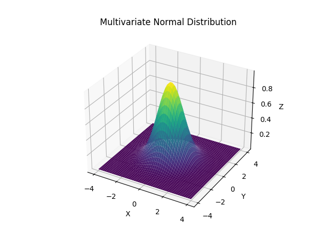
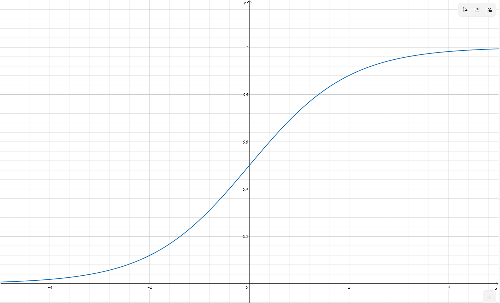

# 6.3 分类问题


分类问题的任务：

- **输入**：N个<mark style="color:orange;">**独立同分布（i.i.d）**</mark>的训练样本$$(\mathbf{x}^i,y^i)\in X\times C$$，$$i=1,2,\dots,N$$
- **目标函数**：$$f\in\mathcal{F}$$
- **损失函数**：$$L(f;x,y)=I_{\{f(\mathbf{x}\neq y\}}$$
- **期望风险**：$$\int I_{\{f(\mathbf{x}\neq y\}}dP(\mathbf{x},y)=P(f(\mathbf{x})\neq y)$$


对于二分类问题，y仅有两个取值-1和1，则其目标为求解一个$$\mathbf{w}$$用于预测y，例如
$$
f(\mathbf{x,w}) = \text{sgn}(\mathbf{w}^T\mathbf{x})=\begin{cases}
1 &\mathbf{w}^T\mathbf{x}>0
\\
-1 &\mathbf{w}^T\mathbf{x}
\end{cases}
$$
理论上，对于使用$$y=-1$$或$$y=1$$的所有样本，都应该有：
$$
\mathbf{w}^T\mathbf{x}y>0
$$
因此，一些方法会试图最小化分错的样本，即最小化：
$$
\hat{E}_p(\mathbf{w}) = -\sum_{i\in T_M}\mathbf{w}^T\mathbf{x}^iy^i
$$
其中，$$T_M$$为错分样本的集合


### 一些常见的分布

#### 伯努利分布

单个二进制变量$$x\in \{0,1\}$$的分布由单个连续参数$$\beta\in[0,1]$$控制：
$$
P(x\vert \beta) = \beta^x(1-\beta)^{1-x}
$$


#### 二项式分布

给出N个服从伯努利分布的样本中观察到$$m$$次$$x=1$$的概率：
$$
P(m\vert N,\beta) = \begin{pmatrix}
N\\m
\end{pmatrix} \beta^m(1-\beta)^{N-m}
$$


#### 多项式分布

多项式分布是二次分布的推广，变量可以取K个状态，第K个状态被观测到了$$m_k$$次的概率为：
$$
P(m_1,\dots,m_k\vert N,\beta) = \begin{pmatrix}
N\\m_1,\dots,m_k
\end{pmatrix}
\prod_{k=1}^K\beta_k^{m_k}
$$

#### 多变量正态分布

对于$$x\sim N(\mu,\Sigma)$$，有

$$
p(x) = \frac{1}{\sqrt{(2\pi)^D\vert\Sigma\vert}}\exp\left(-\frac 12(\mathbf x-\mathbf\mu)^T\Sigma^{-1}(\mathbf x-\mathbf\mu)\right)
$$

其中，$$\vert \Sigma\vert$$为协方差矩阵的行列式，此分布的图像如下图所示：



## 6.3.1 Logistic 回归



Logistic回归属于判别式模型



Logistic回归使用<mark style="color:purple;">**Logistic函数**</mark>估计后验概率：
$$
\begin{align}
p(y=1\vert\mathbf{x}) &= f(\mathbf{x,w}) \nonumber
\\
&= g(\mathbf{w}^T\mathbf{x})
\\
&=\frac{1}{1+\exp(-\mathbf{w}^T\mathbf{x})}
\end{align}
$$


上式中的$$g(x)=\dfrac{1}{1+e^{-z}}$$即为<mark style="color:purple;">**Logistic函数**</mark>，它是一个经典的<mark style="color:purple;">**Sigmoid函数**</mark>

其图像为：

Logistic函数具有以下特性：

- $$z \to \infin$$时，$$g(z)\to 1$$
- $$z \to -\infin$$时，$$g(z)\to 0$$
- 取值在0到1之间
- $$g'(z) = g(z)(1-g(z))$$




### 一、使用最大似然估计求解Logistic回归

对于二分类问题，可以假设样本的输出服从<mark style="color:purple;">**伯努利分布**</mark>（0-1分布），则对于$$y=0$$和$$y=1$$可以统一表达为：
$$
P(y\vert \mathbf{x,w})=(f(\mathbf{x,w}))^y(1-f(\mathbf{x,w}))^{1-y}
$$
则可以得到其似然函数和对数似然函数为：
$$
L(\mathbf{w}) = \prod_{i=1}^NP(y^i\vert \mathbf{x}^i,\mathbf{w}) = \prod_{i=1}^N\left(f(\mathbf{x}^i,\mathbf{w})\right)^{y^i}\left(1-f(\mathbf{x}^i,\mathbf{w})\right)^{1-y^i}
\\
l(\mathbf{w})=\log L(\mathbf{w}) = \sum_{i=1}^N\left(y^i\log f(\mathbf{x}^i,\mathbf{w})+(1-y^i)\log\left(1- f\left(\mathbf{x}^i,\mathbf{w}\right)\right)\right)
$$
梯度为：
$$
\frac{\partial l(\mathbf w)}{\partial w_j} = (y^i-f(\mathbf x^i,\mathbf w))x^i_j,\ \forall(\mathbf x^i,\mathbf w)
$$


则可以使用梯度下降法更新参数：
$$
\textcolor{red}{w_j = w_j + \alpha (y^i - f(\mathbf x^i,\mathbf w))x^i_j}
$$


### 二、多类Logistic回归

思路是使用<mark style="color:purple;">**softmax函数**</mark>取代logistic sigmoid：
$$
P(C_k\vert\mathbf{w,x}) = \frac{\exp(\mathbf w^T_k\mathbf x)}{\sum\limits_{j=1}^N\exp(\mathbf w_j^T\mathbf x)}
$$
而对于y，使用一个K维的<mark style="color:orange;">**独热表示**</mark>的向量来代替，它满足：
$$
\sum_{i=1}^KP(y_i\vert\mathbf{w,x}) = 1
$$
同样的，对于样本的概率分布，采用<mark style="color:purple;">**广义伯努利分布**</mark>表示：
$$
\begin{align}
&P(\mathbf{y|\mu}) = \prod_{i=1}^K\mathbf \mu_i^{y_i} \nonumber
\\
&\mu_i = P(y_i=1\vert \mathbf{w,x})
\end{align}
$$
这样就可以写出似然函数：
$$
P(\mathbf y^1,\mathbf y^2,L\mathbf y^N\vert\mathbf w_1,\dots,\mathbf w_K,\mathbf x^1,\dots,\mathbf x^N) = \prod_{i=1}^N\prod_{k=1}^KP(C_k\vert\mathbf w_k, \mathbf x^i) = \prod_{i=1}^N\prod_{k=1}^K\mu_{ik}^{y_k^i}
$$
其中，$$\mu_{ik}$$为softmax函数：
$$
\mu_{ik} = \frac{\exp (\mathbf w_k^T\mathbf x^i)}{\sum\limits_{j=1}^K\exp(\mathbf w_j^T\mathbf x^i)}
$$
那么，最优化问题就可以写成最小化对数似然函数：


$$
\begin{align}
\min{E} &=\min -\ln P(\mathbf y^1,\dots,\mathbf y^N\vert\mathbf w_1,\dots,\mathbf w_K,\mathbf x^1,\dots,\mathbf x^N) \nonumber
\\
&= \min{\textcolor{red}{-\sum_{i=1}^N\sum_{k=1}^Ky_k^i\ln\mu_{ik}}} \nonumber
\end{align}
$$


上式中的$$E$$即为<mark style="color:purple;">**交叉熵损失函数**</mark>。

对于这个损失函数，采用梯度下降法更新，梯度为：
$$
\frac{\partial E}{\partial \mathbf w_j} = \sum_{i=1}^N(\mu_{ij}-y^i_j)\mathbf x^i
$$


## 6.3.2 高斯判别分析（GDA）



GDA属于生成式模型



GDA使用<mark style="color:purple;">**多变量正态分布**</mark>对$$p(\mathbf x\vert y)$$进行建模：
$$
\begin{align}
 y&\sim Bernoulli(\beta) \nonumber
\\
 (x\vert y = 0) &\sim N(\mathbf\mu_0,\mathbf\Sigma_0)
 \\
  (x\vert y = 1) &\sim N(\mathbf\mu_1,\mathbf\Sigma_1)
\end{align}
$$
则对数似然函数为：
$$
\begin{align}
L(\beta,\mathbf \mu_0,\mathbf \mu_1,\mathbf \Sigma) &= \log\prod_{i=1}^Np(\mathbf x^i,\mathbf y^i;\beta,\mathbf \mu_0,\mathbf \mu_1,\mathbf \Sigma) \nonumber
\\
&=\log\prod_{i=1}^Np(\mathbf y^i;\beta)p(\mathbf x^i\vert\mathbf y^i;\beta,\mathbf \mu_0,\mathbf \mu_1,\mathbf \Sigma)
\end{align}
$$

使用MLE，估计各参数为：
$$
\begin{align}
\beta &=\frac1N\sum_{i=1}^NI_{\{y^i=1\}} \nonumber
\\
\mu_k &= \frac{\sum\limits_{i=1}^NI_{\{y^i=k\}}x^i}{\sum\limits_{i=1}^NI_{\{y^i=k\}}} &k=\{0,1\}
\\
\Sigma&= \frac1N\sum_{i=1}^N(\mathbf x^i - \mathbf\mu_{y^i})(\mathbf x^i - \mathbf\mu_{y^i})^T
\end{align}
$$


### GDA与LR的区别

- GDA有<mark style="color:orange;">**很强的模型假设**</mark>：当假设是正确时，处理数据的效率更高
- LR<mark style="color:orange;">**假设很弱**</mark>：对偏离假设的情况更具鲁棒性
- 实际中，LR更常用
- 在GDA中，特征向量x中的元素是连续的实数
  - 若特征向量中元素是离散的：$$p(x_1,\dots,x_D\vert y)$$


## 6.3.3 朴素贝叶斯（NB）



NB属于生成式模型




假设给定y时，特征分量$$x_j$$<mark style="color:orange;">**相互独立**</mark>：
$$
p(x_1,\dots,x_D\vert y) = \prod_{i=1}^Dp(x_i\vert y)
$$
那么对于给定的训练数据$$(\mathbf x^i,y^i)$$，$$i=1,\dots,N$$，对数似然为：
$$
L = \sum_{i=1}^N\sum_{j=1}^D\left[\log p(\mathbf x_j^i\vert y^i) + \log p(y^i)\right]
$$
使用MLE，估计各参数为：
$$
\begin{align}
&p(x_j=1\vert y=1) = \frac{\sum\limits_{i=1}^NI_{\{x_j^i=1,y^i=1\}}}{\sum\limits_{i=1}^NI_{\{y^i=1\}}} \nonumber
\\
&p(x_j=1\vert y=0) = \frac{\sum\limits_{i=1}^NI_{\{x_j^i=1,y^i=0\}}}{\sum\limits_{i=1}^NI_{\{y^i=0\}}}
\\
&p(y=1) = \frac{\sum\limits_{i=1}^NI_{\{y^i=1\}}}{N}
\end{align}
$$

基于此，即可做出预测：
$$
\begin{align}
p(y=1\vert x) &=\frac{p(x\vert y=1)p(y=1)}{p(x)} \nonumber
\\
&= \frac{\prod\limits_{j=1}^Dp(x_j\vert y=1)p(y=1)}{\prod\limits_{j=1}^Dp(x_j\vert y=1)p(y=1) + \prod\limits_{j=1}^Dp(x_j\vert y=0)p(y=0)}
\end{align}
$$

### 平滑

对于给定的训练集$$\{x^1,\dots,x^N\}$$，利用最大似然估计可以估计变量$$x$$取每个值的概率：
$$
p(x=j)=\frac{\sum\limits_{i=1}^NI_{\{\mathbf x^i=j\}}}{N},\ j=1,\dots,K
$$
然而，如果训练集中某个类别的数据没有涵盖$$x$$的第$$m$$个取值的话，就无法估计相应的条件概率，从而导致模型可能会在测试集上产生误差

对此，可以使用Laplace平滑，在各个估计中加入平滑项：
$$
p(x=j)=\frac{\sum\limits_{i=1}^NI_{\{\mathbf x^i=j\}}+1}{N+K},\ j=1,\dots,K
$$


### NB与LR的区别

- **渐进比较**
  - 当模型假设正确：NB与LR产生相似的分类器
  - 当模型假设不正确
    - LR不假设条件具有独立性，偏差较小
    - LR的表现优于NB
- **非渐进比较**
  - 参数估计的收敛性
    - NB：$$O(\log N)$$
    - LR：$$O(N)$$


## 本节绘图代码

```python
import numpy as np
import matplotlib.pyplot as plt

np.random.seed(0)

mean = np.array([0, 0])
cov = np.eye(2)
data = np.random.multivariate_normal(mean, cov, (2, 2))

x = np.linspace(-4, 4, 30)
y = np.linspace(-4, 4, 30)
X, Y = np.meshgrid(x, y)

Z = np.zeros_like(X)
for i in range(len(x)):
    for j in range(len(y)):
        point = np.array([x[i], y[j]])
        Z[j, i] = np.exp(-0.5 * np.dot(np.dot((point - mean), np.linalg.inv(cov)), (point - mean).T))

fig = plt.figure()
ax = fig.add_subplot(111, projection='3d')
ax.plot_surface (X, Y, Z, cmap='viridis', shade=False)

plt.show()
```

