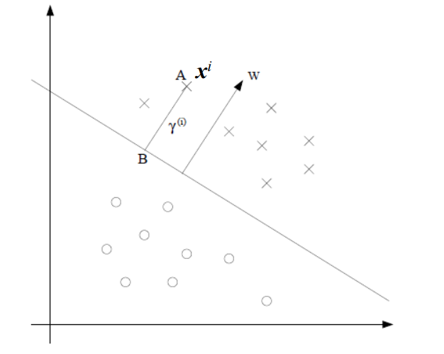
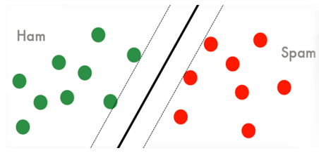
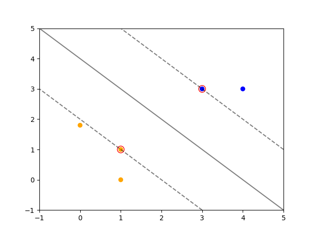

# 7.1 线性支持向量机

## 7.1.1 间隔

### 一、函数间隔

对于一个训练样本$$(\mathbf x^i,y^i)$$，它到$$(\mathbf w,b)$$确定的超平面的<mark style="color:purple;">**函数间隔**</mark>为：
$$
\hat{\gamma}^i = y^i(\mathbf w^T\mathbf x^i+b)
$$
<mark style="color:orange;">**函数间隔与距离是正相关的**</mark>


- $$y^i=1$$，$$(\mathbf w^T\mathbf x^i + b)$$是一个大的正数
- $$y^i=-1$$，$$(\mathbf w^T\mathbf x^i + b)$$是一个比较小的负数
- $$y^i(\mathbf w^T\mathbf x^i+b)>0$$，说明模型对样本的预测是正确的
- <mark style="color:red;">**大的函数间隔→高的预测置信度**</mark>


对于训练数据集$$S = \{(\mathbf x^i,y^i),\ i=1,\dots,N\}$$，它的函数间隔定义为所有样本中<mark style="color:orange;">**最小的**</mark>那个：
$$
\hat{\gamma} = \min_i \hat{\gamma}^i,\ i=1,\dots,N
$$


### 二、几何间隔



对于样本$$(\mathbf x^i,y^i)$$，$$y^i=1$$，它到决策面的距离$$\gamma^i$$是线段AB的长度

其中，点B可以表示为：
$$
\mathbf x^i - \frac{\gamma^i\mathbf w}{\Vert \mathbf w\Vert_2}
$$
由于点B在<mark style="color:purple;">**决策边界**</mark>上，即：
$$
\mathbf w^T\left(\mathbf x^i - \frac{\gamma^i\mathbf w}{\Vert \mathbf w\Vert_2}\right) + b = 0
$$
求解此方程可以得到样本$$(\mathbf x^i,y^i)$$的<mark style="color:purple;">**几何间隔**</mark>为：
$$
\gamma^i = y^i\left(\left(\frac{\mathbf w}{\Vert\mathbf w\Vert_2}\right)^T\mathbf x^i + \frac{b}{\Vert\mathbf w\Vert_2}\right)
$$
同样的，对于训练数据集$$S = \{(\mathbf x^i,y^i),\ i=1,\dots,N\}$$，关于判别界面的几何间隔为：
$$
\gamma = \min_i \gamma^i,\ i=1,\dots,N
$$


**函数间隔与几何间隔的关系**：
$$
\gamma^i = \frac{\hat{\gamma}^i}{\Vert \mathbf w\Vert_2}
\\
\gamma = \frac{\hat{\gamma}}{\Vert \mathbf w\Vert_2}
$$
显然，若$$\Vert \mathbf w\Vert_2=1$$，则二者相等


<mark style="color:red;">**几何间隔具有不变性**</mark>


### 三、最优间隔分类器

假设数据是<mark style="color:orange;">**线性可分**</mark>的

给定一个训练集，一个自然的想法是试图找到一个使<mark style="color:orange;">**几何间隔最大化**</mark>的决策边界，这表示对训练集的有可信的预测并且对训练数据的良好“拟合”



那么就需要最大化间隔，即：
$$
\begin{align}
\max_{\gamma,\mathbf w,b}\ &\gamma \nonumber
\\
s.t.\ &y^i\left(\left(\frac{\mathbf w}{\Vert \mathbf w\Vert_2}\right)^T\mathbf x^i + \frac{b}{\Vert \mathbf w\Vert_2}\right)\geq\gamma,i=1,\dots,N
\end{align}
$$
可以将问题转化为<mark style="color:purple;">**几何间隔**</mark>：
$$
\begin{align}
\max_{\gamma,\mathbf w,b}\ &\frac{\hat{\gamma}}{\Vert \mathbf w\Vert_2} \nonumber
\\
s.t.\ &y^i(\mathbf w^T\mathbf x^i+b)\geq\hat\gamma,i=1,\dots,N
\end{align}
$$
进一步简化问题，**令几何间隔为单位1**：
$$
\begin{align}
\min_{\mathbf w,b}\ &\frac12\Vert\mathbf w\Vert_2^2 \nonumber
\\
s.t.\ &y^i(\mathbf w^T\mathbf x^i+b)\geq1,i=1,\dots,N
\end{align}
$$

也就是说，在分类正确的情况下，样本到判别界面的距离应当大于单位1


## 7.1.2 拉格朗日对偶性

### 一、一般情况

对于一般的含有等式和不等式约束的最优化问题：
$$
\begin{align}
&\min_{w} \quad f(w) \nonumber
\\
&\begin{array}
{r@{\quad} l@{\quad}l}
s.t. &g_i(w)\leq0, &i=1,\dots,k
\\
 &h_i(w) = 0, &i=1,\dots,l
\end{array}
\end{align}
$$
可以定义<mark style="color:purple;">**广义拉格朗日函数**</mark>：
$$
L(w,\alpha,\beta) = f(w) + \color{blue}\sum_{i=1}^k \color{red}{\alpha_i} \color{blue}g_i(w) + \sum_{i=1}^l\color{red}{\beta_i} \color{blue}h_i(w)
$$
 上式中，$$\alpha_i$$和$$\beta_i$$分别是等式约束和不等式约束的<mark style="color:purple;">**拉格朗日乘子**</mark>，并要求$$\color{red}\alpha_i\geq0$$

那么考虑对于$$w$$的函数：
$$
\theta_P(w) = \max_{\alpha,\beta;\alpha_i\geq0}{L(w,\alpha,\beta)}
$$
这里下标P表示<mark style="color:orange;">**原始问题**</mark>

假设存在$$w_i$$使得约束条件不成立（即$$g_i(w)>0$$或$$h_i(w)\neq0$$），则可以通过令$$\alpha_i$$或$$\beta_i$$等于正无穷来使得$$\theta_P(w)=+\infin$$

而若$$w$$满足全部约束，显然可以有$$\theta_P(w) = f(w)$$，即：
$$
\theta_P(w) = 
\begin{cases}
f(w) & w满足约束
\\
+\infin & 其它
\end{cases}
$$
那么如果考虑最小问题：
$$
\min_{w}\quad\theta_P(w) = \min_{w}\max_{\alpha,\beta;\alpha_i\geq0}{L(w,\alpha,\beta)}
$$
它与原始最优化问题是等价的，问题$$\min\limits_{w}\max\limits_{\alpha,\beta;\alpha_i\geq0}{L({w,\alpha,\beta})}$$称为<mark style="color:purple;">**广义拉格朗日函数的极小极大问题**</mark>。这样就将原始问题的最优解转化为了拉格朗日函数的极小极大问题。定义原始问题的最优值
$$
p^* = \min_{x}\quad\theta_P(w)
$$
为<mark style="color:purple;">**原始问题的值**</mark>


### 二、对偶问题

 定义：
$$
\theta_D(\alpha,\beta) = \min_w\quad L(w,\alpha,\beta)
$$

考虑最大化$$\theta_D(\alpha,\beta)$$，即：
$$
\max_{\alpha,\beta;\alpha_i\geq0}\theta_D(\alpha,\beta) = \max_{\alpha,\beta;\alpha_i\geq0} \min_w\quad L(w,\alpha,\beta)
$$
问题$$\max_{\alpha,\beta;\alpha_i\geq0} \min_w\quad L(w,\alpha,\beta)$$称为<mark style="color:purple;">**广义拉格朗日函数的极大极小问题**</mark>。可以将广义拉格朗日函数的极大极小问题表示为如下约束：
$$
\begin{align}
\max_{\alpha,\beta}&\quad\theta_D(\alpha,\beta) = \max_{\alpha,\beta}\ \min_w\ L(w,\alpha,\beta)
\\
\text{s.t.}&\quad\alpha_i\geq0,i=1,\dots,k
\end{align}
$$
这一优化问题就称为原始问题的<mark style="color:purple;">**对偶问题**</mark>，并定义对偶问题的最优解：
$$
d^* = \max_{\alpha,\beta;\alpha_i\geq0}\theta_D(\alpha,\beta)
$$
为对偶问题的值


### 三、原始问题和对偶问题的关系

若原始问题和对偶问题都有最优解，则：
$$
d^* = \max_{\alpha,\beta;\alpha_i\geq0}\min_{w} L(w,\alpha,\beta) \leq \min_w \max_{\alpha,\beta;\alpha_i\geq0} L(w,\alpha,\beta) = p^*
$$


设$$w^*$$和$$\alpha^*$$，$$\beta^*$$分别为原始问题和对偶问题的可行解，若$$\color{red}d^*=p^*$$，则$$w^*$$和$$\alpha^*$$，$$\beta^*$$分别是原始问题和对偶问题的<mark style="color:orange;">**最优解**</mark>




### 四、KKT条件

对于原始问题和对偶问题，假设$$f(w)$$和$$g_i(w)$$是凸函数，$$h_i(w)$$是仿射函数，并且不等式约束是<mark style="color:orange;">**严格执行**</mark>的，即$$g_i(w)<0$$，则存在$$w^*,\alpha^*,\beta^*$$，使得$$w$$是原始问题的解，$$\alpha,\beta$$是对偶问题的解，且：
$$
p^*=d^*=L(w^*,\alpha^*,\beta^*)
$$
它的充分必要条件是以下<mark style="color:purple;">**Karush-Kuhn-Tucker（KKT）条件**</mark>：
$$
\frac{\partial L(w^*,\alpha^*,\beta^*)}{\partial w} = 0
\\
\color{red}\alpha_i^*g_i(w^*)=0,\quad i=1,\dots,k
\\
g_i(w^*)\leq0,\quad i=1,\dots,k
\\
\alpha_i^*\geq0
\\
h_i(w^*) = 0,\quad i=1,\dots,l
$$


其中，上式中标红的部分称为<mark style="color:purple;">**KKT的对偶互补条件**</mark>，总结下来就是：若<mark style="color:orange;">**强对偶**</mark>（$$\alpha_i^*>0$$），则$$\alpha_i^*g_i(w^*)=0$$


## 7.1.3 线性SVM

<mark style="color:red;">**支持向量**</mark>：距分离超平面<mark style="color:orange;">**最近**</mark>的样本


- **输入**：<mark style="color:orange;">**线性可分**</mark>的数据集$$S=\{(\mathbf x^i,y^i),i=1,\dots,N\}$$
- **输出**：判别函数及决策/判别界面
- **最优化问题**

$$
\begin{align}
\min_{\mathbf w,b}\ &\frac12\Vert\mathbf w\Vert_2^2 \nonumber
\\
s.t.\ &y^i(\mathbf w^T\mathbf x^i+b)\geq1,i=1,\dots,N
\end{align}
$$

- **分离超平面**：$$(\mathbf w^*)^T\mathbf x + b^* = 0$$
- **判别函数**：$$f_{\mathbf w,b}(\mathbf x) = sign((\mathbf w^*)^T\mathbf x + b^*)$$




**理论保证**：对于线性可分的训练数据集，最大间隔分类器存在且唯一




### 一、最优间隔分类器的对偶解



对于上面的最优化问题，其约束条件为：
$$
g_i(\mathbf w) = -y^i(\mathbf w^T\mathbf x^i+b) + 1 \leq 0,\quad i=1,\dots,N
$$
由于KKT对偶互补条件为$$\alpha_i^*g_i(w)=0$$，而在本问题中显然至少有一个$$\alpha_i\neq0$$（证明略），因此满足KKT条件即要求：
$$
g_i(\mathbf w^*) = 0
$$
而满足这一条件的样本就是<mark style="color:red;">**支持向量**</mark>，其距离到分离超平面的距离为单位1




支持向量的数量远小于样本数量，因此可以大大减少训练成本




将整个问题写为广义拉格朗日函数：
$$
L(\boldsymbol w,b,\boldsymbol \alpha) = \frac12\Vert\boldsymbol w\Vert_2^2 - \sum_{i=1}^N\alpha_i[y^i(\boldsymbol w^T\boldsymbol x^i + b)-1]
$$
那么它的**对偶问题**为：
$$
\theta_D(\boldsymbol \alpha) = \min_{w,b}L(\boldsymbol w,b,\boldsymbol \alpha)
$$
记对偶问题的最优值为$$d^*$$，令偏导数等于0，求解$$\boldsymbol w^*$$和$$b^*$$：
$$
\begin{align}
&\because\ \frac{\partial}{\partial \boldsymbol w}L(\boldsymbol w,b,\boldsymbol \alpha) = \boldsymbol w - \sum_{i=1}^N\alpha_iy^i\boldsymbol x^i = 0
\\
&\therefore \boldsymbol w^* = \sum_{i=1}^N\alpha_iy^i\boldsymbol x^i
\\
&\quad\frac{\partial}{\partial b}L(\boldsymbol w,b,\boldsymbol \alpha) = \sum_{i=1}^N\alpha_iy^i = 0
\end{align}
$$
带入拉格朗日函数，即有：
$$
\color{red}\theta_D(\boldsymbol \alpha) = \sum_{i=1}^N\alpha_i - \frac12\sum_{i,j=1}^Ny^iy^j\alpha_i\alpha_j(\boldsymbol x^i)^T\boldsymbol x^j
$$

### 二、线性可分SVM的求解过程

输入<mark style="color:orange;">**线性可分**</mark>的训练数据集$$S=\{(\boldsymbol x^i,y^i),i=1,\dots,N\}$$

首先通过求解对偶问题，得到拉格朗日乘子的最优解$$\boldsymbol \alpha^*$$：
$$
\begin{align}
&\max_{\boldsymbol \alpha}\quad \sum_{i=1}^N\alpha_i-\frac12\sum_{i,j=1}^Ny^iy^j\alpha_i\alpha_j(\boldsymbol x^i)^T\boldsymbol x^j \nonumber
\\
&\begin{array}
{r@{\quad} l@{\quad}l}
s.t. & \alpha_i \geq0 &i=1,\dots,N
\\
&\sum\limits_{i=1}^N\alpha_iy^i = 0
\end{array}
\end{align}
$$


进而得到原问题的最优解：
$$
\begin{align}
&\color{red}\boldsymbol w^* = \sum_{i=1}^N\alpha_i^*y^i\boldsymbol x^i
\\
&\color{red}b^* = y^j - \sum_{i=1}^N\alpha^*_iy^i(\boldsymbol x^i)^T\boldsymbol x^j
\end{align}
$$


- **分离超平面**：$$(\boldsymbol w^*)^T\boldsymbol x + b^*=0$$
- **判别函数**：$$f_{\boldsymbol w,b}(\boldsymbol w^*)^T\boldsymbol x + b^*$$




- 在计算$$\boldsymbol w^*$$和$$b^*$$时，只需要利用那些$$\alpha_i>0$$的那些样本（<mark style="color:purple;">**支持向量**</mark>）来计算
- **对偶技巧**：只需要计算训练样本与输入特征的<mark style="color:orange;">**内积**</mark>——$$(\boldsymbol x^i)^T\boldsymbol x = \boldsymbol x^i\cdot \boldsymbol x$$




## 本文中的绘图代码：

```python
import numpy as np
import matplotlib.pyplot as plt
from sklearn.svm import SVC

X = np.array([[3, 3], [4, 3], [1, 1], [1, 0], [0, 1.8]])
y = np.array([1, 1, -1, -1, -1])

svm = SVC(kernel='linear')
svm.fit(X, y)

w = svm.coef_[0]
b = svm.intercept_[0]

plt.scatter(X[:, 0], X[:, 1], c=['b' if label == 1 else 'orange' for label in y])
ax = plt.gca()
x_lim = ax.get_xlim()
y_lim = ax.get_ylim()

# 创建网格以绘制分离超平面
xx = np.linspace(-1, 5, 30)
yy = np.linspace(-1, 5, 30)
YY, XX = np.meshgrid(yy, xx)
xy = np.vstack([XX.ravel(), YY.ravel()]).T
Z = svm.decision_function(xy).reshape(XX.shape)

# 绘制分离超平面和间隔边界
ax.contour(XX, YY, Z, colors='k', levels=[-1, 0, 1], alpha=0.5,
           linestyles=['--', '-', '--'])
# 高亮显示支持向量
ax.scatter(svm.support_vectors_[:, 0], svm.support_vectors_[:, 1], s=100,
           linewidth=1, facecolors='none', edgecolors='r')
plt.show()
```


## 参考

[https://www.kaggle.com/code/alaapdhall/custom-svm-with-numpy-vs-sklearn](https://www.kaggle.com/code/alaapdhall/custom-svm-with-numpy-vs-sklearn)
