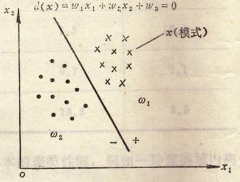
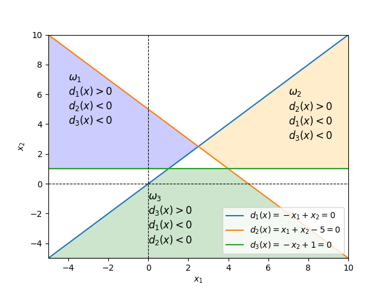
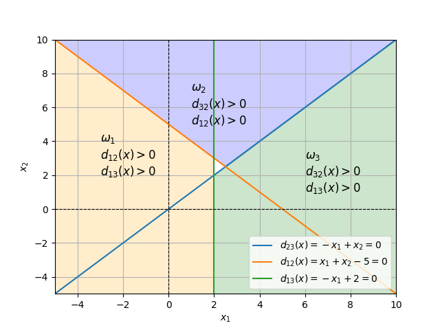

# 3.2 线性判别函数

## 3.2.1 线性判别函数

### 两类问题的判别函数

假设x是二维模式样本$$x=(x_1\ x_2)^T$$，模式的平面图如下：



此时，分属于$$\omega_1$$和$$\omega_2$$两类的模式可以用一个直线方程进行划分：
$$
d(x) = w_1x_1 + w_2x_2 + w_3 = 0
$$
其中，$$x_1$$、$$x_2$$称为<mark style="color:orange;">**坐标变量**</mark>，$$w_1$$、$$w_2$$、$$w_3$$称为<mark style="color:orange;">**参数方程**</mark>，则将一个位置模式带入，有：

- 若$$d(x)>0$$，则$$x\in \omega_1$$
- 若$$d(x)<0$$，则$$x\in \omega_2$$

此处的$$d(x)=0$$就称为<mark style="color:orange;">**判别函数**</mark>


### 用判别函数进行分类的两个因素

- **判别函数的<mark style="color:purple;">几何性质</mark>**
  - 线性的
  - 非线性的
- **判别函数的<mark style="color:purple;">系数</mark>**：使用给定的模式样本确定判别函数的系数


### n维线性判别函数

一个n维线性判别函数可以写为：
$$
d(x)=w_1x_1 + w_2x_2 + \cdots + w_nx_n + w_{n+1} = w_0^Tx + w_{n+1}
$$


其中，$$\boldsymbol{w}_0=(w_1,w_2,\dots,w_n)^T$$称为<mark style="color:orange;">**权向量**</mark>

此外，$$d(x)$$还可以写为：
$$
d(x)=w^Tx
$$
其中，$$\boldsymbol{x}=(x_1,x_2,\dots,x_n,1)$$称为<mark style="color:orange;">**增广模式向量**</mark>，$$\boldsymbol{w}_0=(w_1,w_2,\dots,w_n,w_{n+1})^T$$称为<mark style="color:orange;">**增广权向量**</mark>


## 3.2.2 线性判别函数的三种形式

### 一、$\omega_i\backslash\overline{\omega_i}$两分法

每条判别函数只区分是否属于某一类



上图中，白色区域为分类失败区域

- 将M分类问题分为M个单独的分类问题
- 需要M条线
- 不一定能够找到判别函数区分开其它所有类别


### 二、$$\omega_i\backslash\overline{\omega_j}$$两分法

每一条线分开两种类别




### 三、小结

- **线性可分**：模式分类若可以用任一<mark style="color:purple;">**线性函数**</mark>划分，则称这些模式是<mark style="color:orange;">**线性可分**</mark>的
- 一旦线性函数的系数$$w_k$$被确定，则此函数就可以作为分类的基础
- 两种分类法的比较
  - 对于M分类，法一需要M个判别函数，法二需要$$\frac{M(M-1)}{2}$$个判别函数，因此当模式较多时，法二需要更多的判别函数
  - 但是对于法一而言，并不是每一种情况都是线性可分的，因此法二对模式是线性可分的概率比法一大

## 绘图代码

```python
import matplotlib.pyplot as plt
import numpy as np

x = np.linspace(-5, 10, 100)

y1 = x
y2 = -x + 5
y3 = np.ones_like(x)

plt.plot(x, y1, label='$d_1(x)=-x_1+x_2 = 0$')
plt.plot(x, y2, label='$d_2(x)=x_1+x_2-5 = 0$')
plt.plot(x, y3, label='$d_3(x)=-x_2+1 = 0$')

plt.axhline(y=0, color='black', linestyle='--', linewidth=0.8)
plt.xlabel('$x_1$')
plt.ylabel('$x_2$')
plt.axvline(x=0, color='black', linestyle='--', linewidth=0.8)

plt.fill_between(x, y2, np.maximum(y1, y3), where=(x <= 2.5), color='blue', alpha=0.2)
plt.fill_between(x, y1, np.maximum(y2, y3), where=(x >= 2.5), color='orange', alpha=0.2)
plt.fill([-5, 1, 4, 10], [-5, 1, 1, -5], color='green', alpha=0.2)

plt.annotate('$\\omega_1$\n$d_1(x)>0$\n$d_2(x)<0$\n$d_3(x)<0$',
             xy=(-4, 6), xytext=(-4, 4), fontsize=12, color='black')
plt.annotate('$\\omega_2$\n$d_2(x)>0$\n$d_1(x)<0$\n$d_3(x)<0$',
             xy=(7, 6), xytext=(7, 3), fontsize=12, color='black')
plt.annotate('$\\omega_3$\n$d_3(x)>0$\n$d_1(x)<0$\n$d_2(x)<0$',
             xy=(-1, -4), xytext=(1, -4), fontsize=12, color='black')

plt.xlim(-5, 10)
plt.ylim(-5, 10)

plt.legend(loc='lower right')

plt.show()
```


```python
import matplotlib.pyplot as plt
import numpy as np

x = np.linspace(-5, 10, 100)
y = np.linspace(-5, 10, 100)

y1 = x
y2 = -x + 5
x1 = np.full_like(y, 2)

plt.plot(x, y1, label='$d_{23}(x)=-x_1+x_2 = 0$')
plt.plot(x, y2, label='$d_{12}(x)=x_1+x_2-5 = 0$')
plt.plot(x1, y, label='$d_{13}(x)=-x_1+2 = 0$')

plt.axhline(y=0, color='black', linestyle='--', linewidth=0.8)
plt.xlabel('$x_1$')
plt.ylabel('$x_2$')
plt.axvline(x=0, color='black', linestyle='--', linewidth=0.8)

plt.fill_between(x, np.maximum(y1, y2), 10 * np.ones_like(x), color='blue', alpha=0.2)
plt.fill_between(x, y2, -5 * np.ones_like(x), where=(x <= 2), color='orange', alpha=0.2)
plt.fill_between(x, y1, -5 * np.ones_like(x), where=(x > 1.9), color='green', alpha=0.2)

plt.annotate('$\\omega_1$\n$d_{12}(x)>0$\n$d_{13}(x)>0$',
             xy=(-3, 2), xytext=(-3, 2), fontsize=12, color='black')
plt.annotate('$\\omega_2$\n$d_{32}(x)>0$\n$d_{12}(x)>0$',
             xy=(1, 6), xytext=(1, 5), fontsize=12, color='black')
plt.annotate('$\\omega_3$\n$d_{32}(x)>0$\n$d_{13}(x)>0$',
             xy=(6, 1), xytext=(6, 1), fontsize=12, color='black')

plt.xlim(-5, 10)
plt.ylim(-5, 10)
plt.grid(True)

plt.legend(loc='lower right')

plt.show()
```

