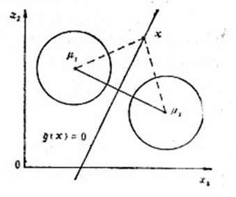

# 3.3 广义线性判别函数

## 3.3.1 基本思想

假设一个模式集$$\{x\}$$，在模式空间$$x$$中<mark style="color:blue;">**线性不可分**</mark>，但是在模式空间$$x^*$$中<mark style="color:blue;">**线性可分**</mark>，其中$$x^*$$中的各分量是$$x$$的<mark style="color:purple;">**单值实函数**</mark>，且$$x^*$$的维度<mark style="color:orange;">**高于**</mark>$$x$$的维度，即：
$$
x^* = (f_1(x),f_2(x),\dots,f_k(x),1)^T\ \ \ k>n
$$
则若有非线性判别函数：
$$
d(x)=w_1f_1(x) + w_2f_2(x) + \cdots + w_kf_k(x) + w_{k+1}
$$

该判别函数可以表示为：
$$
d(x^*)=w^Tx^*
$$

此时非线性判别函数已经被转换为<mark style="color:orange;">**广义线性**</mark>

## 3.3.2 f(x)的选择

### 一、一次函数

若取$$f_i(x)$$为一次函数，则变换后的模式$$x^*=x$$，$$x^*$$的维数k等于$$x$$的维数n，此时广义化后的线性判别式仍然为：
$$
d(x) = w^Tx = w_{n+1}
$$

### 二、二次多项式函数

设x的维度为n，则原判别函数为：
$$
d(x) = \sum_{j=1}^nw_{jj}x_j^2 + \sum_{j=1}^{n-1}\sum_{k=j+1}^nw_{jk}x_jx_k + \sum_{j=1}^nw_jx_j + w_{n+1}
$$
式中包含$$x$$各分量的二次项、一次项和常数项，其中：

- 平方项$$n$$个
- 二次项$$\dfrac{n(n-1)}{2}$$个
- 一次项$$n$$个
- 常数项1个

总的项数为：
$$
n+\frac{n(n-1)}{2} + n +1 = \frac{(n+1)(n+2)}{2} > n
$$
显然对于$$x^*$$，其维数大于$$x$$的原维数，则$$x^*$$的各分量一般化为：
$$
f_i(x) = x_{p_1}^sx_{p_2}^t,\ p_1,p_2=1,2,\dots,n,\ s,t=0,1
$$

### 三、r次多项式

若$$f_i(x)$$为r次多项式函数，x为n维模式，则有：
$$
f_i(x) = x_{p_1}^{s_1}x_{p_2}^{s_2}\cdots x_{p_r}^{s_r},\ p_1,p_2,\dots,p_r=1,2,\dots,n,\ s_1,s_2,\dots,s_r=0,1
$$
此时，判别函数$$d(x)$$可由以下递推关系给出：
$$
\begin{align}
\text{常数项}:\ d^{(0)}(x)&=w_{n+1} \nonumber
\\
\text{一次项}:\ d^{(1)}(x)&=\sum_{p_1=1}^nw_{p_1}x_{p_1} + d^{(0)}(x) \nonumber
\\
\text{二次项}:\ d^{(2)}(x)&=\sum_{p_1=1}^n\sum_{p_2=p_1}^nw_{p_1p_2}x_{p_1}x_{p_2} + d^{(1)}(x) \nonumber
\\
& \cdots \nonumber
\\
\text{r次项}:\ d^{(r)}(x)&=\sum_{p_1=1}^n\sum_{p_2=p_1}^n\dots\sum_{p_r=p_{r-1}}^nw_{p_1p_2\dots p_r}x_{p_1}x_{p_2}\dots x_{p_r} + d^{(r-1)}(x) \nonumber
\end{align}
$$


例：当取r=2，n=2时，写出判别函数
$$
\begin{align}
\text{常数项}:\ d^{(0)}(x)&=w_{n+1} \nonumber
\\
&=w_3 \nonumber
\\
\text{一次项}:\ d^{(1)}(x)&=\sum_{p_1=1}^nw_{p_1}x_{p_1} + d^{(0)}(x) \nonumber
\\
&=w_1x_1+w_2x_2+w_3 \nonumber
\\
\text{二次项}:\ d^{(2)}(x)&=\sum_{p_1=1}^n\sum_{p_2=p_1}^nw_{p_1p_2}x_{p_1}x_{p_2} + d^{(1)}(x) \nonumber
\\
&=w_{11}x_1^2 + w_{12}x_1x_2 + w_{22}x_2^2 + w_1x_1+w_2x_2+w_3 \nonumber
\\
\end{align}
$$


### 四、$$d(x)$$的项数

对于n维x向量，若用r次多项式，$$d(x)$$的权系数的总项数为：
$$
N_w=C_{n+r}^r=\frac{(n+r)!}{r!n!}
$$
可以看出$$d(x)$$的<mark style="color:orange;">**项数随着r和n的增大而迅速增大**</mark>，若采用次数较高的多项式变换，即使原来$$x$$的维数不高，也会使得变换后的$$x^*$$维数很高，给分类带来困难



实际情况可只取r=2，或只选多项式的一部分，例如r=2时只取二次项，略去一次项，以减少$$x^*$$的维数。





例：设有一维样本空间X，所希望的分类是若$$x\leq b$$或$$x\geq a$$，则$$x \in \omega_1$$；若$$b<x<a$$，$$x \in \omega_1$$

显然没有一个线性判别函数能在一维空间中解决上述问题。

要在一维空间中分类，只有定义判别函数：
$$
d(x) = (x-a)(x-b) = x^2 - (a+b)x + ab
$$
对应到二维空间，令：
$$
x_1 = f_1(x) = x^2
\\
x_2 = f_2(x) = x
$$
则可以得到线性判别函数：
$$
d(x) = x_1 - (a+b)x_2 + ab = w^Tx
$$

其中
$$
x = (x_1,\ x_2,\ 1)^T
\\
w = (1,\ -(a+b),\ ab)^T
$$



## 3.3.3 分段线性判别函数

### 一、出发点

- 线性判别函数在进行分类决策时是最简单有效的，但在实际应用中，常常会出现不能用线性判别函数直接进行分类的情况
- 采用广义线性判别函数的概念，可以通过增加维数来得到线性判别，但维数的大量增加会使在低维空间里在解析和计算上行得通的方法在高维空间遇到困难，增加计算的复杂性
- 引入分段线性判别函数的判别过程，它比一般的线性判别函数的错误率小，但又比非线性判别函数简单



简单来说，就是用一个分段函数来逼近非线性的判别函数



### 二、最小距离分类器

设$$\mu_1$$和$$\mu_2$$为两个模式$$\omega_1$$和$$\omega_2$$的聚类中心，定义决策规则：
$$
\Vert x- \mu_1\Vert^2-\Vert x - \mu_2\Vert^2=
\begin{cases}
<0 & x\in \omega_1
\\
>0 & x\in\omega_2
\end{cases}
$$
此时的决策面是两类期望连线的<mark style="color:purple;">**垂直平分面**</mark>，这样的分类器称为<mark style="color:orange;">**最小距离分类器**</mark>

