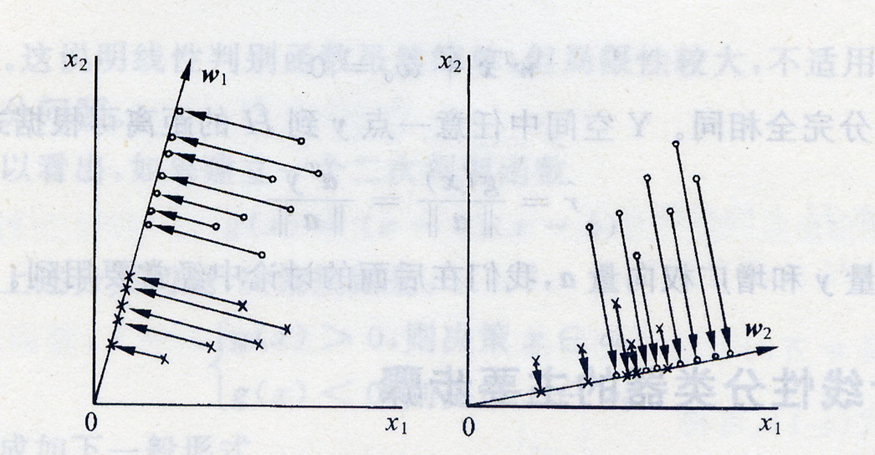

# 3.4 Fisher线性判别

## 3.4.1 概述

**出发点**

- 应用统计方法解决模式识别问题时，一再碰到的问题之一就是维数问题
- 在低维空间里解析上或计算上行得通的方法，在高维空间里往往行不通
- 因此，<mark style="color:purple;">**降低维数**</mark>有时就会成为处理实际问题的关键

**问题描述**

- 考虑把d维空间的样本投影到一条直线上，形成一维空间，即把维数压缩到一维
- 然而，即使样本在d维空间里形成若干紧凑的互相分得开的集群，当把它们投影到一条直线上时，也可能会是几类样本混在一起而变得无法识别
- 但是，在一般情况下，总可以找到某个方向，使在这个方向的直线上，样本的投影能分得开



<mark style="color:orange;">**Fisher判别方法**</mark>所要解决的基本问题，就是如何根据实际情况找到一条最好的、最易于分类的投影线



## 3.4.2 降维的数学原理

从d维空间降到一维空间的一般数学变换方法：

- 设有一集合$$\Gamma$$包含N个d维样本$$x_1,x_2,\dots,x_N$$，其中$$N_1$$个属于$$\omega_1$$类的样本记为子集$$\Gamma_1$$，$$N_2$$个属于$$\omega_2$$类的样本记为子集$$\Gamma_2$$，若对$$x_n$$的分量做线性组合可得标量：

$$
y_n = \boldsymbol{w}^T\boldsymbol{x}_n,\ \ n=1,2,\dots,N
$$

- 这样可以得到N个一维样本$$y_n$$组成的集合，且可以分为两个子集$$\Gamma_1,\Gamma_2$$
- 这里关心的是$$\boldsymbol{w}$$的方向，即<mark style="color:purple;">**样本投影的方向**</mark>，而具体的值并不重要，只是一个比例因子
- 所以，抽象到数学层面，本质就是寻找最好的变换向量$$\boldsymbol{w}^*$$

## 3.4.3 Fisher准则

### 一、Fisher准则中的基本参量

**在高维空间X中：**

- 各样本的均值向量$$\boldsymbol{m}_i$$

$$
\boldsymbol{m}_i = \frac{1}{N_i}\sum_{x\in \Gamma_i}x,\ \ i=1,2
$$

- 样本类内离散度矩阵$$S_i$$和总样本类内离散度矩阵$$S_w$$

$$
\begin{align}
S_i &= \sum_{x\in\Gamma_i}(x-m_i)(x-m_i)^T,\ \ i=1,2 \nonumber
\\
S_w &= S_1 + S_2 \nonumber
\end{align}
$$

- 样本类间离散度矩阵$$S_b$$，$$S_b$$是一个<mark style="color:purple;">**对称半正定矩阵**</mark>

$$
S_b = (m_1-m_2)(m_1-m_2)^T
$$

**在一维空间Y中：**

- 各类样本的均值$$\widetilde{m}_i$$

$$
\widetilde{m}_i = \frac{1}{N_i}\sum_{y \in \Gamma_i}y,\ \ i=1,2
$$

- 样本类内离散度$$\widetilde{S}_i^2$$和总样本类内离散度$$\widetilde{S}_w$$

$$
\begin{align}
\widetilde{S}_i^2 &= \sum_{y\in \Gamma_i}(y-\widetilde{m}_i)^2,\ \ i=1,2\nonumber
\\
\widetilde{S}_w &= \widetilde{S}_1^2 + \widetilde{S}_2^2
\end{align}
$$



我们希望投影后，在一维Y空间中各类样本尽可能分得开些，同时各类样本内部尽量密集，实际上就是

- 两类之间的<mark style="color:purple;">**均值**</mark>相差<mark style="color:orange;">**越大越好**</mark>
- 类内的<mark style="color:purple;">**离散度**</mark><mark style="color:orange;">**越小越好**</mark>



## 3.4.3 Fisher准则函数的定义

Fisher准则函数定义为：
$$
J_F(w) = \frac{(\widetilde{m}_1 - \widetilde{m}_2)^2}{\widetilde{S}_1^2 + \widetilde{S}_2^2}
$$
而其中，样本均值可以写为：
$$
\begin{align}
\widetilde{m}_i &= \frac{1}{N_i}\sum_{y \in \Gamma_i}y \nonumber
\\
&= \frac{1}{N_i}\sum_{x\in\Gamma_i}w^Tx \nonumber
\\
&= w^T\left(\frac{1}{N_i}\sum_{x\in\Gamma_i}x\right) \nonumber
\\
&= w^Tm_i \nonumber
\end{align}
$$
则准则函数的分子可以写为：
$$
\begin{align}
(\widetilde{m}_1 - \widetilde{m}_2)^2 &= (w^Tm_1 - w^Tm_2)^2 \nonumber
\\
&=(w^Tm_1 - w^Tm_2)(w^Tm_1 - w^Tm_2)^T \nonumber
\\
&= (w^Tm_1 - w^Tm_2)(m_1^Tw - m_2^Tw) \nonumber
\\
&=w^T(m_1-m_2)(m_1-m_2)^Tw \nonumber
\\
&=w^TS_bw
\end{align}
$$
而由于
$$
\begin{align}
\widetilde{S}_i^2 &= \sum_{y\in \Gamma_i}(y-\widetilde{m}_i)^2 \nonumber
\\
&= \sum_{x\in\Gamma_i}(w^Tx-w^Tm_i)^2 \nonumber
\\
&= w^T\left[\sum_{x\in\Gamma_i}(x-m_i)(x-m_i)^T\right]w \nonumber
\\
&= w^TS_iw \nonumber
\end{align}
$$
因此分母可以写成：
$$
\begin{align}
\widetilde{S}_1^2 + \widetilde{S}_2^2 &= w^T(S_1 + S_2)w \nonumber
\\
&= w^TS_ww
\end{align}
$$
将上述各式带回$$J_F(w)$$，可得：
$$
J_F(w) = \frac{w^TS_bw}{w^TS_ww}
$$

## 3.4.4 最佳变换向量求解
