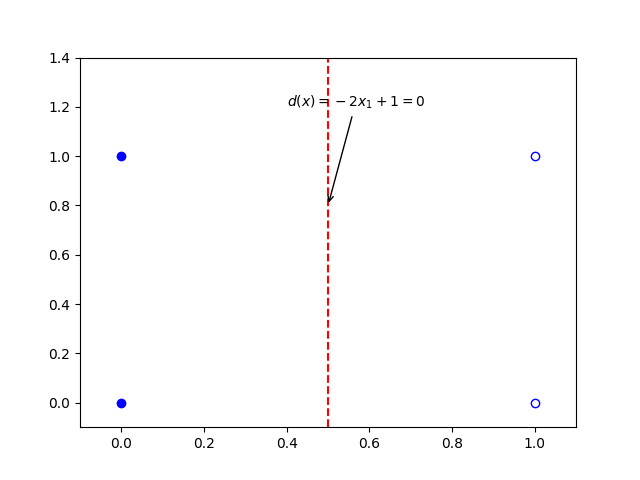

# 3.5 感知器算法

## 3.5.1 概述

- 一旦判别函数的形式确定下来，不管它是线性的还是非线性的，剩下的问题就是如何确定它的系数
- 在模式识别中，系数确定的一个主要方法就是通过对已知样本的训练和学习来得到
- 感知器算法就是通过训练样本模式的迭代和学习，产生线性（或广义线性）可分的模式判别函数

采用<mark style="color:orange;">**感知器算法**</mark>（Perception Approach）能通过对训练模式样本集的“学习”得到判别函数的系数。



这里采用的算法不需要对各类别中模式的统计性质做任何假设，因此称为<mark style="color:orange;">**确定性**</mark>的方法



## 3.5.2 感知器的训练算法

已知两个训练模式集分别属于$$\omega_1$$类和$$\omega_2$$类，权向量的初始值为$$\boldsymbol{w}(1)$$，可任意取值。则在用全部训练模式集进行迭代训练时，第k次的训练步骤为：

- 若$$x_k\in\omega_1$$且$$\boldsymbol{w}^T(k)x_k\leq0$$或$$x_k\in\omega_2$$且$$\boldsymbol{w}^T(k)x_k>0$$，则说明分类器对第k个模式做出了错误分类，此时应该<mark style="color:purple;">**校正权向量**</mark>，使得

$$
w(k+1)=w(k)-Cx_k
$$
​	其中C为<mark style="color:orange;">**校正增量**</mark>

- 否则，则说明分类正确，因此权向量不变：

$$
w(k+1)=w(k)
$$

若对$$x\in\omega_2$$的模式样本乘以-1，则有：
$$
\text{若}\boldsymbol{w}^T(k)x_k\leq0,\text{则}w(k+1)=w(k)+Cx_k
$$
因此，感知器算法可以统一写成：
$$
w(k+1) = 
\begin{cases}
w(k) & \boldsymbol{w}^T(k)x_k > 0
\\
w(k) + Cx_k & \boldsymbol{w}^T(k)x_k\leq0
\end{cases}
$$



感知器算法本质上是一种<mark style="color:orange;">**赏罚过程**</mark>

- 对正确分类的“赏”本质是“不罚”
- 对错误分类的“罚”，本质是给权向量加上一个正比于$$x_k$$的分量





将属于$$\omega_2$$的训练样本乘以-1，并写作增广向量的形式，则有：
$$
\begin{align}
x_1&=(0,0,1)^T \nonumber
\\
x_2&=(0,1,1)^T\nonumber
\\
x_3&=(-1,0,-1)^T\nonumber
\\
x_4&=(-1,-1,-1)^T\nonumber
\end{align}
$$
接下来开始迭代

第一轮，取$$C=1,w(1)=(0,0,0)^T$$

$$\boldsymbol{w}^T(1)x_1=(0,0,0)(0,0,1)^T=0\not\gt 0$$，因此$$\boldsymbol{w}(2)=\boldsymbol{w}(1) + x_1 = (0,0,1)^T$$

$$\boldsymbol{w}^T(2)x_2=(0,0,1)(0,1,1)^T=1\gt 0$$，因此$$\boldsymbol{w}(3)=\boldsymbol{w}(2)= (0,0,1)^T$$

$$\boldsymbol{w}^T(3)x_3=(0,0,1)(-1,0,-1)^T=-1\not\gt 0$$，因此$$\boldsymbol{w}(4)=\boldsymbol{w}(3) + x_3 = (-1,0,0)^T$$

$$\boldsymbol{w}^T(4)x_4=(-1,0,0)(-1,-1,-1)^T=1\gt 0$$，因此$$\boldsymbol{w}(5)=\boldsymbol{w}(4) = (-1,0,0)^T$$

由于上一轮迭代中还存在不大于0的情况，因此继续第二轮迭代：

$$\boldsymbol{w}^T(5)x_1=(-1,0,0)(0,0,1)^T=0\not\gt 0$$，因此$$\boldsymbol{w}(6)=\boldsymbol{w}(5) + x_1 = (-1,0,1)^T$$

$$\boldsymbol{w}^T(6)x_2=(-1,0,1)(0,1,1)^T=1\gt 0$$，因此$$\boldsymbol{w}(7)=\boldsymbol{w}(6) = (-1,0,1)^T$$

$$\boldsymbol{w}^T(7)x_3=(-1,0,1)(-1,0,-1)^T=0\not\gt 0$$，因此$$\boldsymbol{w}(8)=\boldsymbol{w}(7) + x_3 = (-2,0,0)^T$$

$$\boldsymbol{w}^T(8)x_4=(-2,0,0)(-1,-1,-1)^T=2\gt 0$$，因此$$\boldsymbol{w}(9)=\boldsymbol{w}(8) = (-2,0,0)^T$$

仍然不是全满足，继续第四轮迭代：

$$\boldsymbol{w}^T(9)x_1=(-2,0,0)(0,0,1)^T=0\not\gt 0$$，因此$$\boldsymbol{w}(10)=\boldsymbol{w}(9) + x_1 = (-2,0,1)^T$$

$$\boldsymbol{w}^T(10)x_2=(-2,0,1)(0,1,1)^T=1\gt 0$$，因此$$\boldsymbol{w}(11)=\boldsymbol{w}(10) = (-2,0,1)^T$$

$$\boldsymbol{w}^T(11)x_3=(-2,0,1)(-1,0,-1)^T=1\gt 0$$，因此$$\boldsymbol{w}(12)=\boldsymbol{w}(11) = (-2,0,1)^T$$

$$\boldsymbol{w}^T(12)x_4=(-2,0,1)(-1,-1,-1)^T=1\gt 0$$，因此$$\boldsymbol{w}(13)=\boldsymbol{w}(12) = (-2,0,1)^T$$

仍然有一个不满足，继续第四轮迭代：

$$\boldsymbol{w}^T(13)x_1=(-2,0,1)(0,0,1)^T=1\gt 0$$，因此$$\boldsymbol{w}(14)=\boldsymbol{w}(13) = (-2,0,1)^T$$

$$\boldsymbol{w}^T(14)x_2=1\gt 0$$，因此$$\boldsymbol{w}(15)=\boldsymbol{w}(14) = (-2,0,1)^T$$

$$\boldsymbol{w}^T(15)x_3=1\gt 0$$，因此$$\boldsymbol{w}(16)=\boldsymbol{w}(15) = (-2,0,1)^T$$

$$\boldsymbol{w}^T(16)x_2=1\gt 0$$，因此解向量为$$(-2,0,1)^T$$，对应的判别函数即为：
$$
d(x) = -2x_1+1
$$




感知器算法的<mark style="color:orange;">**收敛性**</mark>

只要模式类别是线性可分的，就可以在有限的迭代步数里求出权向量



## 3.5.3 使用感知器算法的多模式分类

