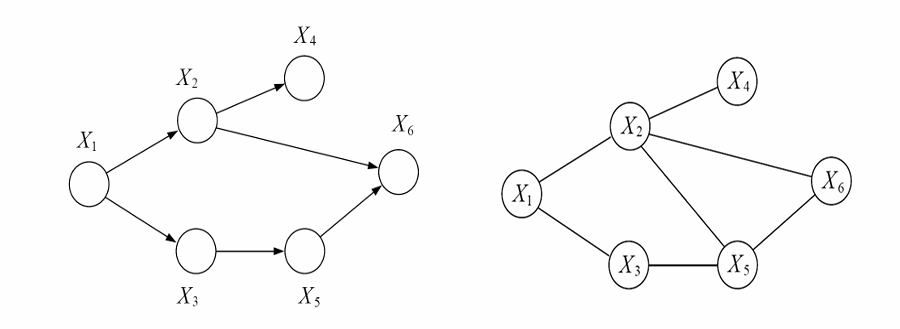

# 11.1 PGM简介



<mark style="color:purple;">**概率图模型**</mark>（Probabilistic Graphical Models）

多元随机变量的<mark style="color:orange;">**条件独立性**</mark>的概率模型



它的**特点**是<mark style="color:orange;">**结构预测**</mark>，即输入输出是“序列→序列”的形式，是元素具有依赖约束的序列预测：
$$
\hat{\boldsymbol y} = \arg\max\limits_{\boldsymbol y}p(\boldsymbol{y\vert x})\quad \boldsymbol y\in \mathcal Y, \vert\mathcal Y\vert很大
$$

而传统分类问题，y的取值代表分类，只有有限的几个值，并且不是序列：
$$
\hat y = \arg\max\limits_y p (y\vert x)\quad y\in\{1,-1\}
$$

## 11.1.1 三大问题

- <mark style="color:red;">**表示**</mark>：能够用模型去描述随机变量之间依赖关系
  - **联合概率**：$$P(X) = P(x_1,x_2,\dots,x_D)=P(X_O,X_H)$$
  - **条件独立性**：$$\{x_i\}\perp \{x_j\}\vert\{x_n\}$$
- <mark style="color:red;">**推断**</mark>：给定观测数据，逆向推理，回答非确定性问题
  - **条件概率**：用已知观测变量推测未知变量分布$$P(X_H\vert X_O)$$
- <mark style="color:red;">**学习**</mark>：给定观测数据，学习最佳模型（结构、参数）
  - **联合概率**最大化时的M参数：

$$
\Theta^*=\arg\max\limits_\theta P(X\vert\theta)
$$

### 一、表示



用图表示的概率分布



**节点**：表示随机变量/状态

**边**：表示概率关系

#### 类型

- <mark style="color:red;">**有向概率图模型**</mark>（<mark style="color:purple;">**贝叶斯网络**</mark>）：因果关系
- <mark style="color:red;">**无向概率图模型**</mark>（<mark style="color:purple;">**马尔可夫随机场**</mark>）：关联关系

### 二、推断

如何根据模型和给定的数据回答问题？

用已知的变量推断未知变量的分布：

- **边缘概率**：$$p(x_i)$$
- **最大后验概率**：$$y^*=\arg\max p(y\vert x_1,x_2,\dots,x_D)$$

### 三、学习

- **参数学习**：模型结构已知，求最佳参数
- **结构学习**：变量间依赖关系未知，从数据中学习

$$
\mathcal M^*=\arg\max\limits_{\mathcal M\in M} F(\mathcal D;\mathcal M)
$$

## 附录：概率论相关知识

