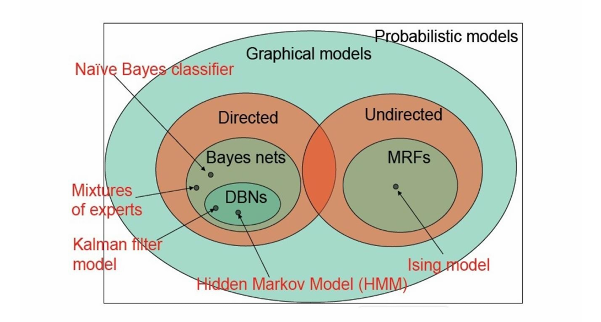

# 11.2 两类概率图模型

## 11.2.1 有向概率图模型（贝叶斯网络）



有向图模型可以表示<mark style="color:orange;">**因果关系**</mark>

我们经常观察子变量并依此推断出父变量的分布



#### 有向图的例子

- **朴素贝叶斯**：假设在给定y的情况下，特征$$X_j$$之间条件独立
- 隐马尔科夫模型
- 卡尔曼滤波
- 因子分析
- 概率主成分分析
- 独立成分分析
- 混合高斯
- 转换成分分析
- 概率专家系统
- sigmoid信念网络
- ……

### 一、有向图的例子

