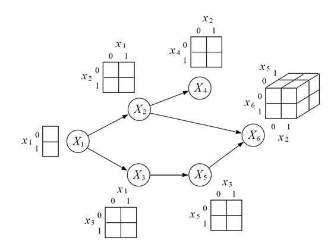
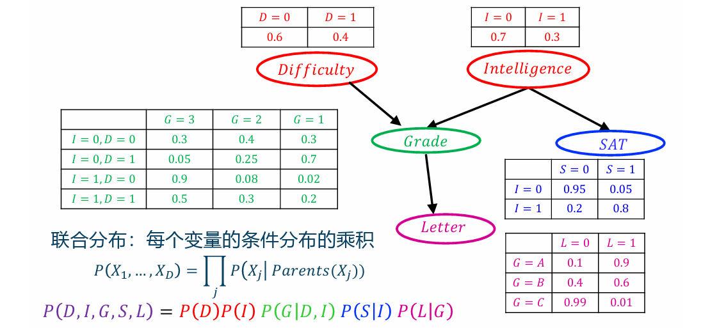
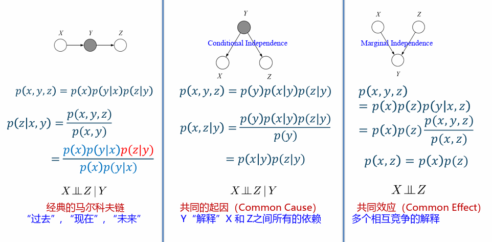
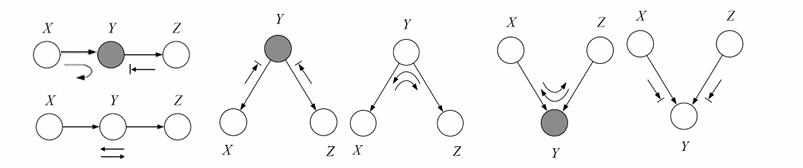

# 11.2 有向图模型（贝叶斯网络）



有向图模型可以表示<mark style="color:orange;">**因果关系**</mark>

我们经常观察子变量并依此推断出父变量的分布



#### 有向图的例子

- **朴素贝叶斯**：假设在给定y的情况下，特征$$X_j$$之间条件独立
- 隐马尔科夫模型
- 卡尔曼滤波
- 因子分析
- 概率主成分分析
- 独立成分分析
- 混合高斯
- 转换成分分析
- 概率专家系统
- sigmoid信念网络
- ……

## 11.2.1 贝叶斯网络

1. **概率分布**：用于查询/推断
2. **表示**：具体实现
3. **条件独立**：模型的解释

### 一、概率分布

一个概率图模型对应着一族概率分布（a family of probability distribution）

每一个<mark style="color:purple;">**节点**</mark>对应着一个<mark style="color:purple;">**条件概率分布**</mark>$$p(x_j\vert x_{\pi_j})$$，其中$$\pi_j$$表示节点j的<mark style="color:orange;">**父节点集合**</mark>

联合概率分布可以表示为：
$$
p(x_1,x_2,\dots,x_D)= \prod_{j=1}^Dp(x_j\vert x_{\pi_j})
$$

如对于上面的图而言，有：
$$
p\left(x_1, x_2, x_3, x_4, x_5, x_6\right)=p\left(x_1\right) p\left(x_2 \mid x_1\right) p\left(x_3 \mid x_1\right) p\left(x_4 \mid x_2\right) p\left(x_5 \mid x_3\right) p\left(x_6 \mid x_2, x_5\right)
$$

### 二、表示



贝叶斯网络使用一些列变量间的<mark style="color:orange;">**局部关系**</mark>紧凑的表示<mark style="color:purple;">**联合分布**</mark>



通过上面一节中的方式，可以将变量的数量由$$O(2^D)$$变为$$O(D\times2^k)$$

而通常，变量数$$D$$是远大于状态数$$k$$的

具体而言，每一个节点有一个<mark style="color:purple;">**条件概率表（CPT）**</mark>，如下面的例子中：

很显然，变量的数量得以大大的减少了

### 三、条件独立

**拓扑排序**：定义图G中节点的顺序$$I$$，若对于每个节点$$i\in V$$，它的父节点都在这个顺序中出现在它之前，则称$$I$$为<mark style="color:purple;">**拓扑排序**</mark>

对于节点$$j$$，给定图G的拓扑排序$$I$$，假设$$v_j$$表示在$$I$$中除了$$\pi_j$$之外所有出现在节点$$j$$之前的节点，有以下定则：



给定一个节点的父节点，则该节点和它的祖先节点<mark style="color:orange;">**条件独立**</mark>
$$
\{X_j \perp X_{v_j} \mid X_{\pi_j}\}
$$


### 四、三种经典图

#### 解释消除

对于多因一果（即上图中第三种），假设各种“因”之间是相互独立的，若已经确定发生了其中一种原因导致了结果，那么由于其他原因导致结果发生的概率就下降了，因此上面一图的独立是**没有条件的**

**例子**：结果是草地湿了，原因是下雨和园丁浇水。本来浇水和下雨是独立的，但若已经知道了草地湿是下雨导致的，那么浇水的概率就下降了

## 11.2.2 条件独立的快速检验（贝叶斯球）

### 一、贝叶斯球的动作

- <mark style="color:red;">**通过**</mark>：贝叶斯球可以从当前节点的子节点到达其父节点，或从其父节点到达其子节点
- <mark style="color:red;">**反弹**</mark>：对于子节点，父节点反弹来自子节点的球，子节点可以到达其各个兄弟节点；父节点方向同理
- <mark style="color:red;">**截止**</mark>：不对贝叶斯球有任何响应

### 二、规则

- <mark style="color:orange;">**未知节点**</mark>：
  - 总能使贝叶斯球<mark style="color:red;">**通过**</mark>
  - <mark style="color:red;">**反弹**</mark>来自子节点的球
- <mark style="color:orange;">**已知节点**</mark>
  - <mark style="color:red;">**反弹**</mark>来自父节点的球
  - <mark style="color:red;">**截止**</mark>来自子节点的球

对于中间节点Y，若贝叶斯球不能由X经由Y到达Z（或由Z经由Y到达X），则称X和Z关于Y<mark style="color:orange;">**条件独立**</mark>
