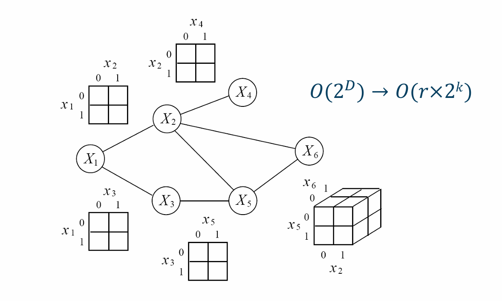
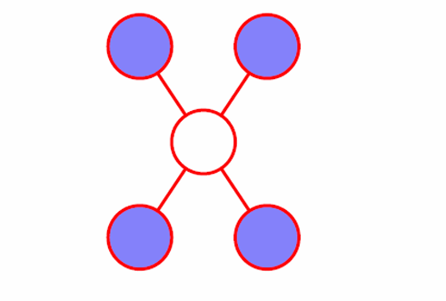

# 11.3 无向图模型（马尔科夫随机场）

## 11.3.1 马尔科夫随机场

### 一、概率分布



<mark style="color:purple;">**团**</mark>：无向图中任何两个节点均有边相连的节点子集称为团

<mark style="color:purple;">**极大团**</mark>：若C是无向图G的一个团，并且不能再加入G中的任何一个节点使其称为更大的团，则称C为G的一个极大团



将无向图模型的联合概率分布表示为其极大团上的随机变量的函数的乘积的形式，称为概率无向图模型的<mark style="color:orange;">**因子分解**</mark>

给定无向图G，C为G上的极大团，$$X_C$$表示C对应到随机变量。则无向图模型的联合概率分布$$P(X)$$可以表示为图中所有<mark style="color:purple;">**极大团**</mark>上的函数$$\Psi_C(X_C)$$的乘积形式：
$$
P(X) = \frac1Z\prod_C\Psi_C(X_C)
$$

其中，Z是<mark style="color:purple;">**归一化因子**</mark>：
$$
Z=\sum_X\prod_C\Psi_C(X_C)
$$

### 二、表示

同样的，通过利用局部参数去表示联合概率，大大的缩小了参数的量

### 三、条件独立

相较于有向图，无向图的条件独立较为简单：

对于一个无向图，一个节点所有的邻居节点，构成该节点的<mark style="color:purple;">**马尔科夫包裹**</mark>。



只要给定任一节点的邻居，则该节点和其余节点独立。



## 11.3.2 势函数

在上式中，$$\Psi_C(X_C)$$称为<mark style="color:purple;">**势函数**</mark>。一般来说，势函数既不是条件概率也不是边际概率，这里一般要求势函数是严格正的，因此一般定义为指数函数：
$$
\Psi_C(X_C) = \exp\{-H_C(X_C)\}
$$
将其带入，可以得到

