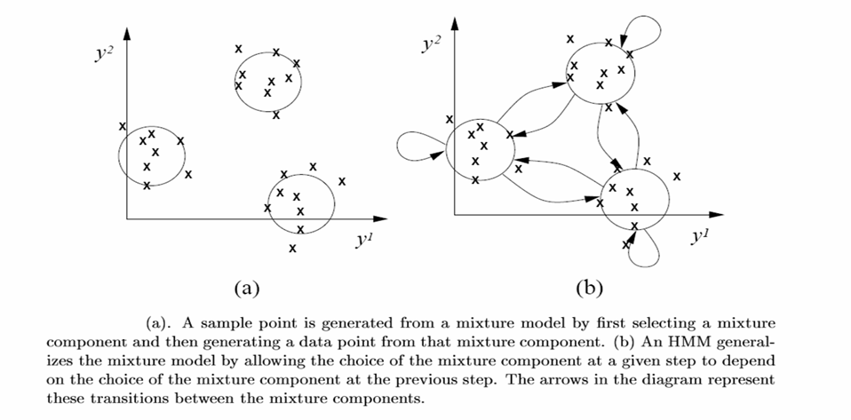
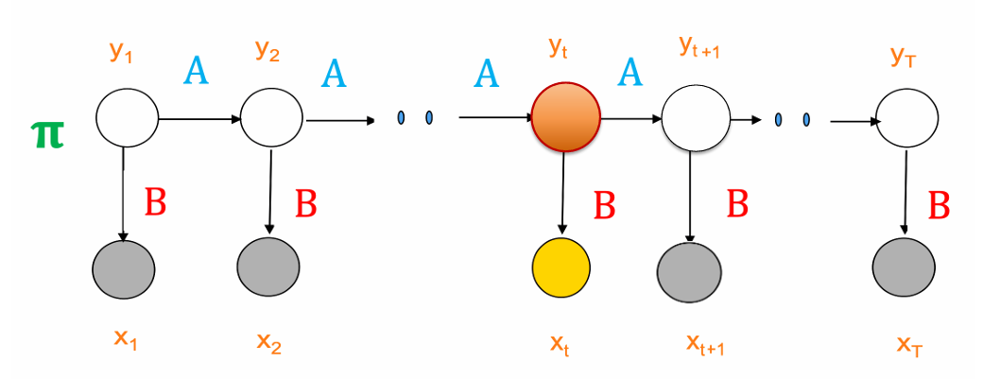

# 11.4 典型概率图模型

## 11.4.1 隐马尔科夫模型（HMM）

### 一、HMM的结构

- <mark style="color:purple;">**状态节点**</mark>：顶层节点表示隐含变量 $$y_t$$
- <mark style="color:purple;">**输出节点**</mark>：底层节点表示观测变量$$x_t$$

这里定义$$x_t^j$$表示观测变量在t时刻取j的概率，隐含变量同理

### 二、HMM的表示

假设隐含变量$$y_t$$的取值范围为状态空间$$\{s_1,\dots,s_N\}$$，观测变量$$x_t$$的取值范围为$$\{o_1,\dots,o_M\}$$，则有：

- <mark style="color:green;">**初始状态分布**</mark>：隐含变量的初始概率分布

$$
\boldsymbol \pi =(\pi_1,\dots,\pi_N),\quad\pi_i=P(y_1^i=1)
$$

- <mark style="color:blue;">**状态转移矩阵**</mark>：大小为$$N^2$$

$$
\boldsymbol A = \begin{pmatrix}
a_{11} & \cdots & a_{1j} & \cdots &a_{1N}\\
\vdots & \ddots & \vdots & &\vdots\\
a_{i1} & \cdots & a_{ij} &\cdots & a_{iN}\\
\vdots & & \vdots & \ddots &\vdots\\
a_{N1} & \cdots & a_{Nj} & \cdots &a_{NN}
\end{pmatrix}
$$

其中
$$
a_{ij} = P(y_{t+1}^j\mid y_t^i=1),\quad 1\leq i\leq N,1\leq j\leq N
$$
表示t+1时刻从状态i变为状态j的概率

- <mark style="color:red;">**发射概率矩阵**</mark>：大小为$$N\times M$$

$$
\boldsymbol B = \begin{pmatrix}
b_{11} & \cdots & b_{1j} & \cdots & b_{1M}\\
\vdots & \ddots & \vdots & &\vdots\\
b_{i1} & \cdots & b_{ij} &\cdots & b_{iM}\\
\vdots & & \vdots & \ddots &\vdots\\
b_{N1} & \cdots & b_{Nj} & \cdots & b_{NM}
\end{pmatrix}
$$

其中
$$
b_{ij}=P(x_t^j=1\mid y_t^i=1),\quad 1\leq i\leq N,1\leq j\leq M
$$
表示若t时刻隐含变量处于i状态，观测到变量为j状态的概率

因此，对于$$(\boldsymbol{x,y})=(x_0,x_1,\dots,x_T,y_0,y_1\dots,y_T)$$的<mark style="color:orange;">**联合概率**</mark>，可以表示为：
$$
\color{orange} p(x,y) = \color{green}p(y_1)\color{blue}\prod_{t=1}^{T-1}p(y_{t+1}\mid y_t)\color{red}\prod_{t=1}^Tp(x_t\mid y_t)
$$
