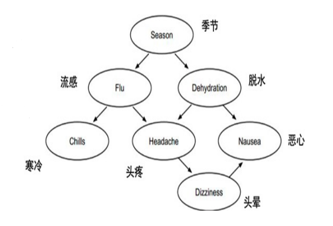
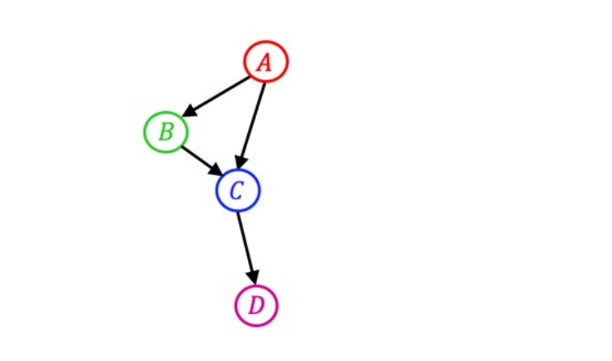
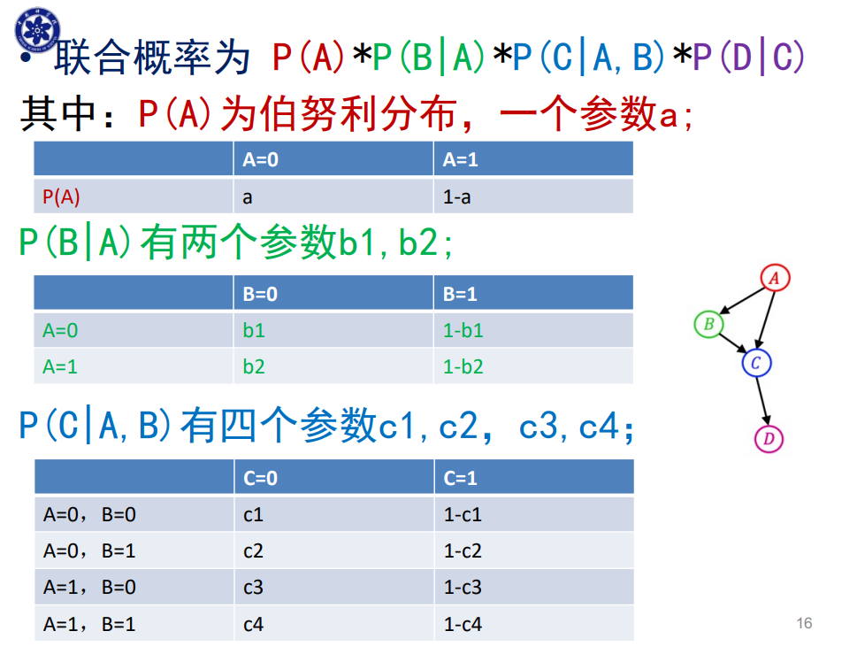

# 附 第十一章作业

# 作业1

## 题目

假设我们要采用HMM实现一个英文的词性标注系统，系统中共有20种词性，则状态转移矩阵B的大小为（）

- A、20
- B、40
- C、400


## 答

**C**：状态转移矩阵代表着从每一种状态在下一时刻向另一状态转移的概率，因此大小为$$20^2=400$$


# 作业2

## 题目

已知以下贝叶斯网络,包含 7 个变量，即 Season (季节)，Flu (流感)，Dehydration (脱水)，Chills (发 冷)，Headache (头疼)，Nausea (恶心)，Dizziness (头晕)，则下列（条件）独立成立的是（）



- A、Season$$\perp$$Chills $$\mid$$ Flu
- B、Season$$\perp$$Chills
- C、Season$$\perp$$Headache $$\mid$$ Flu


## 答

若贝叶斯球不能从A到B，则有条件独立。

- A
  - 已知Flu，它会截止来自子节点的贝叶斯球，从Chills发出的球无法到达Season
  - Dehydration未知，来自Season的贝叶斯球可以通过它到达Headache
    - 已知Flu，它会截止来自子节点的贝叶斯球，从Headache出发的贝叶斯球无法到达Chills
- B
  - Flu未知，能够使贝叶斯球通过，Season和Chills之间可以到达
- C
  - Flu已知，根据A的推导，贝叶斯球可以从Season到达Headache


因此**A**条件独立


# 作业3

## 题目

已知以下贝叶斯网络，包含4个二值变量，则该网络一共有（）个参数



- A、4
- B、8
- C、9
- D、16


## 答

**C**：1+2+4+2=9，具体如下：




## 作业4

### 题目

假设你有三个盒子，每个盒子里都有一定数量的苹果和桔子。每次随机选择一个盒子，然后从盒子里选一个水果，并记录你的发现（a代表苹果，0代表橘子）。不幸的是，你忘了写下你所选的盒子，只是简单地记下了苹果和桔子。假设每个盒子中水果数量如下：

- 盒子一：2个苹果，2个橘子
- 盒子二：3个苹果，1个橘子
- 盒子三：1个苹果，3个橘子

（1）请给出HMM模型

（2）请给出水果序列$$x=(a,a,o,o,o)$$对应的最佳盒子序列


### 答

（1）

初始状态矩阵
$$
\boldsymbol\pi = (\frac13,\frac13,\frac13)
$$
状态转移矩阵
$$
\boldsymbol A=\begin{pmatrix}
\frac13 & \frac13 & \frac13\\
\frac13 & \frac13 & \frac13\\
\frac13 & \frac13 & \frac13
\end{pmatrix}
$$
发射概率矩阵
$$
\boldsymbol B = \begin{pmatrix}
\frac12 & \frac12\\
\frac34 & \frac14\\
\frac14 & \frac34
\end{pmatrix}
$$


（2）使用Viterbi解码

初始化：
$$
V_1^k=p(x_1,y_1=s_k)=\pi_kb_{y_1,x_1}
$$
则本题中，初始化为如下状态：

> [1/6 1/4 1/12]

接下来，开始迭代运算：
$$
V_t^k=p(x_t\mid y_t^k=1)\ \max_i(a_{i,k}V_{t-1}^i)
$$
最后回溯每次的最优解得到答案。

使用numpy求解这部分运算：

```python
import numpy as np

from fractions import Fraction

np.set_printoptions(formatter={'all': lambda x: str(Fraction(x).limit_denominator())})

states = ['box1', 'box2', 'box3']
observables = ['a', 'o']

pi = np.array([1 / 3, 1 / 3, 1 / 3])
A = np.array([[1 / 3, 1 / 3, 1 / 3],
              [1 / 3, 1 / 3, 1 / 3],
              [1 / 3, 1 / 3, 1 / 3]])
B = np.array([[1 / 2, 1 / 2],
              [3 / 4, 1 / 4],
              [1 / 4, 3 / 4]])
obs_sequence = ['a', 'a', 'o', 'o', 'o']
obs_idx = [observables.index(x) for x in obs_sequence]


def viterbi(_obs_sequence, _pi, _A, _B):
    T = len(_obs_sequence)
    N = len(states)
    V = np.zeros((T, N))
    path = np.zeros((T, N), dtype=int)
    for t in range(T):
        if t == 0:
            V[t] = _pi * _B[:, obs_idx[t]]

            print('----------init-----------')
            print(V[0])
        else:
            print(f'--------iter {t}----------')
            for j in range(N):
                V[t, j] = np.max(V[t - 1] * A[:, j]) * B[j, obs_idx[t]]
                path[t, j] = np.argmax(V[t - 1] * A[:, j])
            print(V[t])

    print('----------end-----------')
    print(V.T)
    print('------------------------')
    print(path.T)

    print('----------回溯-----------')
    y = np.zeros(T, dtype=int)
    y[-1] = np.argmax(V[-1])

    for t in range(T - 1, 0, -1):
        y[t - 1] = path[t, y[t]]

    print(y)


viterbi(obs_sequence, pi, A, B)
```

输出如下：

```bash
----------init-----------
[1/6 1/4 1/12]
--------iter 1----------
[1/24 1/16 1/48]
--------iter 2----------
[1/96 1/192 1/64]
--------iter 3----------
[1/384 1/768 1/256]
--------iter 4----------
[1/1536 1/3072 1/1024]
----------end-----------
[[1/6 1/24 1/96 1/384 1/1536]
 [1/4 1/16 1/192 1/768 1/3072]
 [1/12 1/48 1/64 1/256 1/1024]]
------------------------
[[0 1 1 2 2]
 [0 1 1 2 2]
 [0 1 1 2 2]]
----------回溯-----------
[1 1 2 2 2]
```

