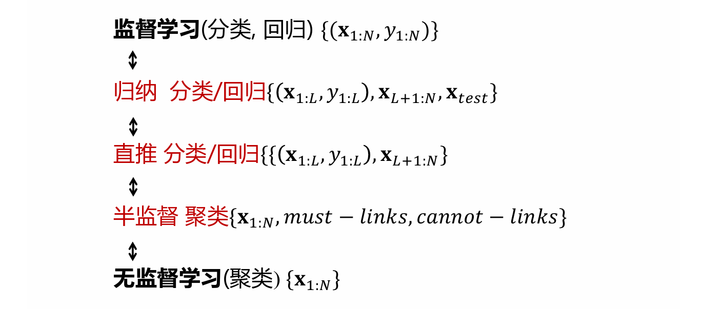

# 10.1 基本概念

## 10.1.1 常见的学习方式

### 一、归纳学习与直推式学习

- <mark style="color:purple;">**归纳学习（Inductive learning）**</mark>：能够处理全新的数据
  - 给定训练数据集$$D=\{(\boldsymbol x_1, y_1),\dots,(\boldsymbol x_L,yL)\}$$，<mark style="color:orange;">**无标注数据**</mark>$$D_U=\{\boldsymbol x_{L+1},\dots\boldsymbol x_{L+U}\}$$（$$U\gg L$$）
  - 学习一个函数$$f$$用于预测<mark style="color:orange;">**新来的测试数据**</mark>的标签
- <mark style="color:purple;">**直推式学习（Transductive learning）**</mark>：只能处理见过的数据，对于新的数据需要重新训练模型
  - 给定训练数据集$$D=\{(\boldsymbol x_1, y_1),\dots,(\boldsymbol x_L,yL)\}$$，<mark style="color:orange;">**无标注数据**</mark>$$D_U=\{\boldsymbol x_{L+1},\dots\boldsymbol x_{L+U}\}$$（$$U\gg L$$）
  - 可以没有显式的学习函数，关心的是在$$D_U$$上的预测

### 二、半监督学习

- **通用想法**：同时利用有标签数据和无标记数据进行训练
- **半监督分类/回归**
  - 给定训练数据集$$D=\{(\boldsymbol x_1, y_1),\dots,(\boldsymbol x_L,yL)\}$$，无标注数据$$D_U=\{\boldsymbol x_{L+1},\dots\boldsymbol x_{L+U}\}$$（$$U\gg L$$）
  - **目标**：学习一个分类器$$f$$，比只用标记数据训练效果更好
- **半监督聚类/降维**
  - 给定标注数据$$\{\boldsymbol x_i\}_{i=1}^N$$
  - **目的**：聚类或降维
  - **限制**
    - 两个点必须在一个簇，或两个点一定不在一个簇
    - 两个点降维后必须接近

## 10.1.2 几种假设

### 一、平滑假设

**半监督学习的平滑假设**：如果<mark style="color:orange;">**高密度**</mark>空间中两个点$$\boldsymbol x_1,\boldsymbol x_2$$距离较近，则对应的输出$$y_1,y_2$$也应该接近

**监督学习的平滑假设**：如果空间中两个点$$\boldsymbol x_1,\boldsymbol x_2$$距离较近，那么对应到输出$$y_1,y_2$$也应该接近

