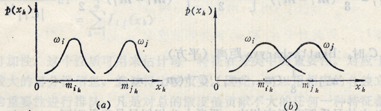
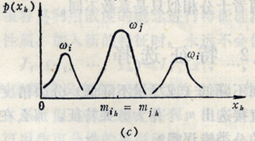

# 4.2 特征选择

## 4.2.1 概念

设有n个可用作分类的测量值，为了在尽量不降低分类精度的前提下，减小特征空间的维数以减少计算量，需从中直接选出m个作为分类的特征。

**那么，怎么选呢？**

要从n个特征值中选出m个，共有$$C_n^m=\dfrac{n!}{m!(n-m)!}$$种选法，使用穷举法对每种选法进行测试耗时过大，因此需要寻找一种简便的可分性准则，间接判断每种子集的优劣

## 4.2.2 类间可分性准则



- 对于不同类别模式之间，<mark style="color:purple;">**均值向量**</mark>间的距离应该尽可能的大
- 对于同一类的模式特征，<mark style="color:purple;">**方差**</mark>之和应该尽可能的小



假设各原始特征测量值是统计独立的，此时，只需对训练样本的n个测量值独立地进行分析，从中选出m个最好的作为分类特征即可。



例：对于$$\omega_i$$和$$\omega_j$$两类训练样本，设其均值向量为$$\boldsymbol{m}_i$$和$$\boldsymbol{m}_j$$，其在k维度方向上的分量为$$m_{ik}$$、$$m_{jk}$$，方差为$$\sigma_{ik}^2$$和$$\sigma_{jk}^2$$

则定义可分性准则函数：
$$
G_K=\frac{(m_{ik}-m_{jk})^2}{\sigma_{ik}^2+\sigma_{jk}^2},\ k=1,2,\dots,n
$$
若$$G_k$$越大，代表测度值的第k个分量对分离两类越有效。将$$G_K,\ k=1,2,\dots,n$$按照大小分类，选出最大的m个对应的测度值既可作为分类特征。



## 4.2.3 可分性准则的适用范围

- 对于（a）中的特征$$x_k$$，其分布有着很好的可分性，通过它可以分离两种类别
- 对于（b）中的特征$$x_k$$，其分布存在很大的重叠，单靠$$x_k$$不足以打到较好的分类，需要添加其他特征

- 对于（c）中$$\omega_i$$的特征$$x_k$$，它的分布有两个最大值，虽然与$$\omega_j$$不存在重叠，但是由于计算出来$$G_k$$约等于0，因此它作为可分性准则已经不再合适



**总结**：假若类概率密度函数不是或不近似正态分布，均值和方差就不足以用来估计类别的可分性，此时该准则函数不完全适用



## 4.2.4 一般特征的散布矩阵准则

<mark style="color:purple;">**类内离散度矩阵**</mark>：
$$
S_w=\sum_{i=1}^cP(\omega_i)E\{(x-m_i)(x-m_i)^T\vert\omega_i\}
$$
<mark style="color:purple;">**类间离散度矩阵**</mark>：
$$
S_b = \sum_{i=1}^cP(\omega_i)(m_i-m_0)(m_i-m_0)^T
$$
由上可以推出散布矩阵准则采用以下两种形式：

- 行列式形式

$$
J_1=\det(S_w^{-1}S_b)=\prod_{i}\lambda_i
$$

- 迹形式

$$
J_2=\text{tr}(S_w^{-1}S_b)=\sum_{i}\lambda_i
$$

其中，$$\lambda_i$$是矩阵$$S_w^{-1}S_b$$的<mark style="color:purple;">**特征值**</mark>，使得$$J_1$$和$$J_2$$最大的子集可以作为可选择的分类特征。



这里计算的散布矩阵不受模式分布形式的限制，但需要有足够数量的模式样本才能获得有效的结果



