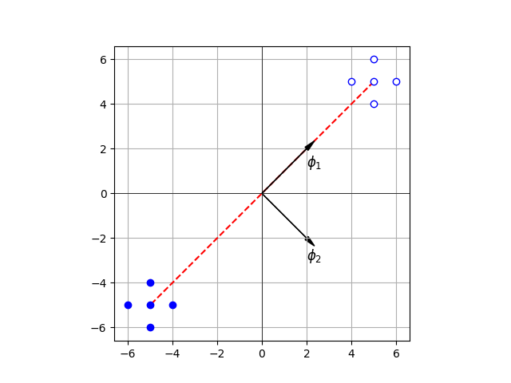

# 4.3 离散K-L变换

- 前面讨论的特征选择是在一定准则下，从n个特征中选出k个来反映原有模式
- 这种简单删掉某n-k个特征的做法并不十分理想，因为一般来说，原来的n个数据各自在不同程度上反映了识别对象的某些特征，简单地删去某些特征可能会丢失较多的有用信息
- 如果将原来的特征做正交变换，获得的每个数据都是原来n个数据的线性组合，然后从新的数据中选出少数几个，使其尽可能多地反映各类模式之间的差异，而这些特征间又尽可能相互独立，则比单纯的选择方法更灵活、更有效




K-L变换（Karhunen-Loeve变换）就是一种适用于任意概率密度函数的<mark style="color:orange;">**正交变换**</mark>




## 4.3.1 离散的有限K-L展开

### 一、展开式的推导

设有一连续的随机实函数$$x(t)$$，$$T_1\leq t\leq T_2$$，则$$x(t)$$可用已知的正交函数集$$\{\varphi_j(t),\ j=1,2,\dots\}$$的线性组合展开，即：
$$
\begin{align}
x(t) &= a_1\varphi_1(t) + a_2\varphi_2(t) + \cdots+a_j\varphi_j(t) + \cdots \notag 
\\
&= \sum_{j=1}^\infty a_j\varphi_j(t),\ \ T_1\leq t\leq T_2 \tag{1}
\end{align}
$$
其中$$a_j$$为展开式的<mark style="color:purple;">**随即系数**</mark>，$$\varphi_j(t)$$为一<mark style="color:purple;">**连续的正交函数**</mark>，满足：
$$
\int_{T_1}^{T_2}\varphi_n(t)\tilde{\varphi}_m(t)dt=\begin{cases}
1 & m=n
\\
0 & m\neq n
\end{cases}
$$
其中，$$\tilde{\varphi}_m(t)$$为$$\varphi_m(t)$$的<mark style="color:purple;">**共轭复数**</mark>形式


将上式写成离散的正交函数形式，使得连续随机函数$$x(t)$$和连续正交函数$$\varphi_j(t)$$在区间$$T_1\leq t \leq T_2$$内被<mark style="color:orange;">**等间隔采样**</mark>为n个离散点，即：
$$
x(t) \to \{x(1),x(2),\cdots,x(n)\}
\\
\varphi_j(t) \to \{\varphi_j(1),\varphi_j(2),\cdots,\varphi_j(n)\}
$$
写成向量形式，则有：
$$
x = (x(1),x(2), \cdots, x(n))^T
\\
\varphi_j=(\varphi_j(1),\varphi_j(2),\cdots,\varphi_j(n))^T
$$


则可以对公式$$(1)$$取n项近似，并写成离散展开形式：
$$
x=\sum_{j=1}^na_j\varphi_j = \varphi a,\ \ T_1\leq t\leq T_2
$$
其中，$$a$$为展开式中的随即系数的向量形式，$$\varphi$$为一$$n\times n$$矩阵，即：
$$
a=(a_1,a_2,\dots,a_j,\dots,a_n)^T
\\
\\
\varphi = 
\begin{bmatrix}
\varphi_1(1) & \varphi_2(1) & \cdots & \varphi_n(1)
\\
\varphi_1(2) & \varphi_2(2) & \cdots & \varphi_n(2)
\\
\vdots & \vdots & \ddots & \vdots
\\
\varphi_1(n) & \varphi_2(n) & \cdots & \varphi_n(n)
\end{bmatrix}
$$
可以看出，$$\varphi$$本质上是一个<mark style="color:orange;">**正交变换矩阵**</mark>，它将$$x$$变换成$$a$$。


### 二、K-L展开式的性质



如果对c种模式类别$$\{\omega_i\}_{i=1,\dots,c}$$做离散正交展开，则对每一模式可分别写成：$$x_i=\varphi a_i$$，其中矩阵$$\varphi$$取决于所选用的正交函数

对各个模式类别，正交函数都是<mark style="color:orange;">**相同的**</mark>，但其展开系数向量$$a_i$$则因类别的不同模式分布而异




K-L展开式的根本性质是将随机向量x展开为另一组正交向量$$\varphi_j$$的线性和，且其展开式系数$$a_j$$（即系数向量a的各个分量）具有不同的性质。


### 三、变换矩阵和系数的计算

设随机向量x的<mark style="color:purple;">**总体自相关矩阵**</mark>为$$R=E\{xx^T\}$$，由：
$$
x=\sum_{j=1}^n a_j\varphi_j=\varphi a,\ \ T_1\leq t\leq T_2 \tag{2}
$$


将$$X=\varphi a$$带入自相关矩阵，可得：
$$
\begin{align}
R &= E\{\varphi a a^T\varphi^T\} \notag
\\
&= \varphi (E\{aa^T\})\varphi^T \notag
\end{align}
$$
要求系数向量$$\boldsymbol{a}$$的各个不同分量应<mark style="color:orange;">**独立**</mark>，即应使$$(a_1, a_2, …, a_j, …, a_n)$$满足如下关系：
$$
E(a_ja_k) = \begin{cases}
\lambda_j & j=k
\\
0 & j\neq k
\end{cases}
$$
写成矩阵形式，应使：$$E\{a a^T\} = D_\lambda$$，其中$$D_\lambda$$为对角形矩阵，其互相关成分均为0，即：
$$
D_\lambda = 
\begin{bmatrix}
\lambda_1 & 0 & \cdots & \cdots 0
\\
0 & \ddots & 0 & \cdots & 0
\\
0 & \cdots & \lambda_j & \cdots & 0
\\
0 & \cdots & 0 & \ddots & 0
\\
0 & \cdots & \cdots & 0 & \lambda_n
\end{bmatrix}
$$
则自相关矩阵可以写成：
$$
R=\varphi D_\lambda \varphi^T
$$
由于$$\varphi$$中各个向量都相互<mark style="color:orange;">**归一正交**</mark>，因此有：
$$
R\varphi = \varphi D_\lambda \varphi^T \varphi = \varphi D_\lambda
$$
其中，$$\varphi_j$$向量对应为：
$$
R \varphi_j=\lambda_j\varphi_j
$$
可以看出，$$\lambda_j$$是x的自相关矩阵R的<mark style="color:orange;">**特征值**</mark>，$$\varphi_j$$是对应的<mark style="color:orange;">**特征向量**</mark>。因为R是实对称矩阵，其不同特征值对应的特征向量应正交，即：
$$
\varphi_j^T\varphi_k = 
\begin{cases}
1 & j=k
\\
0 & j\neq k
\end{cases}
$$
带入式$$(2)$$，K-L展开式的系数为：
$$
a = \varphi^Tx
$$




总结而言，计算l K-L展开式系数可以分为以下三步：

1. 求随机向量x的自相关矩阵：$$R = E\{xx^T\}$$
2. 求R的特征值和特征向量，得到矩阵$$\varphi=(\varphi_1,\varphi_2,\dots,\varphi_n)$$
3. 求展开式系数：$$a=\varphi^Tx$$




## 4.3.2 按照K-L展开式选择特征

- K-L展开式用于特征选择相当于一种线性变换
- 若从n个特征向量中取出m个组成变换矩阵$$\varphi$$，即：

$$
\varphi = (\varphi_1\ \varphi_2\ \dots\ \varphi_m),\ m<n
$$

此时，$$\varphi$$是一个n*m维矩阵，x是n维向量，经过$$\varphi^Tx$$变换，即得到降维为m的新向量


### 推导

**问题**：选取变换矩阵$$\varphi$$，使得降维后的新向量在<mark style="color:orange;">**最小均方差条件下**</mark>接近原来的向量x


对于$$x=\sum\limits_{j=1}^n$$，现在仅仅取m项，**对略去的系数项用预先选定的常数b代替**，此时对x的估计值为：
$$
\hat{x} = \sum_{j=1}^ma_i\varphi_i + \sum_{j=m+1}^nb\varphi_j
$$
则产生的误差为：
$$
\Delta x = x - \hat{x} = \sum_{j=m+1}^n(a_j-b)\varphi_j
$$
此时$$\Delta x$$的<mark style="color:purple;">**均方差**</mark>为：

$$
\begin{align}
\overline{\varepsilon^2} &= E\{\Vert\Delta x\Vert\}^2 \nonumber
\\
&= \sum_{j=m+1}^n\{E(a_j-b)^2\} \nonumber
\end{align}
$$
要使得$$\overline{\varepsilon^2}$$最小，则对b的选择应满足：
$$
\begin{align}
\frac{\partial}{\partial b}[E(a_j-b)^2] &= \frac{\partial}{\partial b}[E(a_j^2-2a_jb+b^2)] \nonumber
\\
&= -2[E(a_j)-b] \nonumber
\\
&=0 \nonumber
\end{align}
$$
因此，$$b=E[a_j]$$，即<mark style="color:orange;">**对省略掉的a中的分量，应使用它们的数学期望来代替**</mark>，此时的误差为：
$$
\begin{align}
\overline{\varepsilon^2} &= \sum_{j=m+1}^nE[(a_j-E\{a_j\})^2] \nonumber
\\
&= \sum_{j=m+1}^n\varphi^T_jE[(x-E\{x\})(x-E\{x\})^T]\varphi_j \nonumber
\\
&= \sum_{j=m+1}^n\varphi_j^TC_x\varphi_j \nonumber
\end{align}
$$
其中，$$C_x$$为x的<mark style="color:purple;">**协方差矩阵**</mark>


设$$\lambda_j$$为$$C_x$$的第j个特征值，$$\varphi_j$$是与$$\lambda_j$$对应的特征向量，则：
$$
C_x\varphi_j = \lambda_j\varphi_j
$$
由于$$\varphi_j$$是一个正交阵，因此有：
$$
\varphi_j^T\varphi_j=1
$$
从而
$$
\varphi_j^TC_x\varphi_j = \lambda_j
$$
因此
$$
\begin{align}
\overline{\varepsilon^2} &= \sum_{j=m+1}^n\varphi_j^TC_x\varphi_j \nonumber
\\
&= \sum_{j=m+1}^n\lambda_j
\end{align}
$$


由此可以看出，<mark style="color:orange;">**特征值越小，误差也越小**</mark>


### 结论

从K-L展开式的性质和按最小均方差的准则来选择特征，应使$$E[a_j]=0$$。由于$$E[a]=E[\varphi^Tx]= \varphi^TE[x]$$，故应使$$E[x]=0$$。基于这一条件，在将整体模式进行K-L变换之前，应先将其均值作为新坐标轴的原点，采用协方差矩阵C或自相关矩阵R来计算特征值。如果$$E[x]\neq0$$，则只能得到“次最佳”的结果。

将K-L展开式系数$$a_j$$（亦即变换后的特征）用$$y_j$$表示，写成向量形式：$$y= \varphi^Tx$$。此时变换矩阵$$\varphi$$用m个特征向量组成。为使误差最小，不采用的特征向量，其对应的<mark style="color:orange;">**特征值应尽可能小**</mark>。因此，将特征值按大小次序标号，即
$$
\lambda_1\gt\lambda_2\gt\dots\gt\lambda_m\gt\dots\gt\lambda_n\geq0
$$
若首先采用前面的m个特征向量，便可使变换误差最小。此时的变换矩阵为：
$$
\varphi^T = \begin{pmatrix}
\varphi_1^T\\
\varphi_2^T\\
\vdots\\
\varphi_m^T
\end{pmatrix}
$$
K-L变换是在均方误差最小的意义下获得数据压缩（降维）的最佳变换，且不受模式分布的限制。对于一种类别的模式特征提取，它不存在特征分类问题，只是实现用低维的m个特征来表示原来高维的n个特征，使其误差最小，亦即使其整个模式分布结构尽可能保持不变。

通过K-L变换能获得互不相关的新特征。若采用较大特征值对应的特征向量组成变换矩阵，则能对应地保留原模式中方差最大的特征成分，所以K-L变换起到了减小相关性、突出差异性的效果。在此情况下， K-L变换也称为<mark style="color:orange;">**主成分变换**（**PCA变换**）</mark>。



需要指出的是，采用K-L变换作为模式分类的特征提取时，要特别注意保留不同类别的模式分类鉴别信息，仅单纯考虑尽可能代表原来模式的主成分，有时并不一定有利于分类的鉴别。






给定两类模式，其分布如图所示，试用K-L变换实现一维的特征提取（假定两类模式出现的概率相等）


$$
m = \frac{1}{5}\sum_{j=1}^{N_i}x_{1j}+\frac{1}{5}\sum_{j=1}^{N_i}x_{2j}=0
$$
这符合K-L变换进行特征压缩的最佳条件。

由于$$P(\omega_1)=P(\omega_2)=0.5$$，故：
$$
\begin{align}
R &= \sum_{j=1}^2P(\omega_i)E\{xx^T\} \nonumber
\\
&= \frac{1}{2}\left[\frac{1}{5}\sum_{j=1}^5x_{1j}x_{1j}^T\right] + \frac{1}{2}\left[\frac{1}{5}\sum_{j=1}^5x_{2j}x_{2j}^T\right] \nonumber
\\
\\
&= \begin{pmatrix}
25.4 & 25.0\\
25.0 & 25.4
\end{pmatrix}
\end{align}
$$
解特征值方程$$\vert R-\lambda E\vert$$，求R的特征值：$$\lambda_1=50.4,\lambda_2=0.4$$，求解对应的特征向量，得到：
$$
\varphi_1=\frac{1}{\sqrt{2}}\begin{pmatrix}
1
\\
1
\end{pmatrix}
&
\varphi_2=\frac{1}{\sqrt{2}}\begin{pmatrix}
1
\\
-1
\end{pmatrix}
$$
取较大的特征值$$\lambda_1$$对应的变换向量作为变换矩阵，由$$y=\varphi^Tx$$得到变换后的一维模式特征为：
$$
\omega_1:\left\{-\frac{10}{\sqrt2},-\frac{9}{\sqrt2},-\frac{9}{\sqrt2},-\frac{11}{\sqrt2},-\frac{11}{\sqrt2}\right\}
\\
\omega_2:\left\{\frac{10}{\sqrt2},\frac{11}{\sqrt2},\frac{11}{\sqrt2},\frac{9}{\sqrt2},\frac{9}{\sqrt2}\right\}
$$


上面的例子中可以看到


## 绘图代码

```python
import matplotlib.pyplot as plt
import numpy as np

x = [4, 5, 5, 5, 6, -4, -5, -5, -5, -6]
y = [5, 4, 5, 6, 5, -5, -4, -5, -6, -5]

plt.plot([5, -5], [5, -5], color='red', linestyle='--')
plt.arrow(0, 0, 2, 2, head_width=0.2, head_length=0.5, fc='black', ec='black', zorder=2)
plt.arrow(0, 0, 2, -2, head_width=0.2, head_length=0.5, fc='black', ec='black')
plt.plot(x[0:5], y[0:5], 'o', color='white', markeredgecolor='blue')
plt.plot(x[5:10], y[5:10], 'o', color='blue')


plt.annotate('$\\phi_1$', xy=(2, 1.2), xytext=(2, 1.2), fontsize=12)
plt.annotate('$\\phi_2$', xy=(2, -3), xytext=(2, -3), fontsize=12)

plt.axhline(0, color='black', linewidth=0.5)
plt.axvline(0, color='black', linewidth=0.5)

plt.gca().set_aspect('equal', adjustable='box')
plt.grid(True)

plt.show()
```

