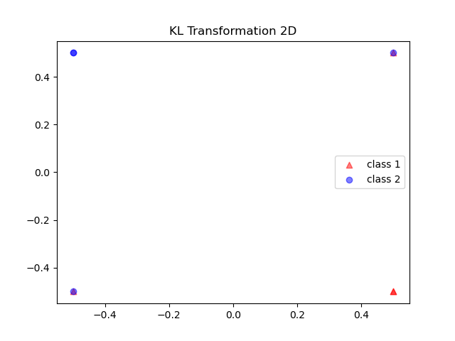
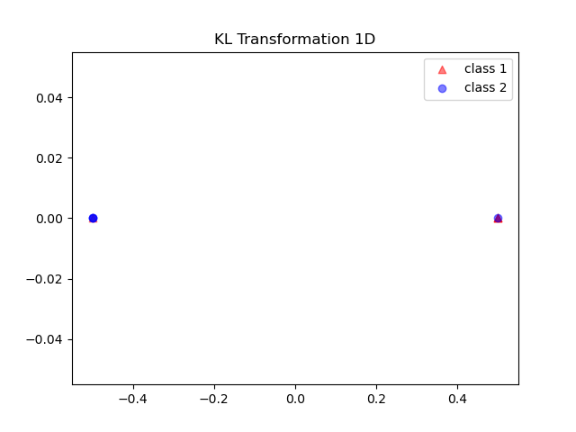

# 附 第四章作业

## Q1

### 题目

设有如下三类模式样本集$$\omega_1$$，$$\omega_2$$和$$\omega_3$$，其先验概率相等，求$$S_w$$和$$S_b$$
$$
\begin{align}
&\omega_1: \{(1\ 0)^T,(2\ 0)^T,(1\ 1)^T\}\\
&\omega_2: \{(-1\ 0)^T,(0\ 1)^T,(-1\ 1)^T\}\\
&\omega_3: \{(-1\ -1)^T,(0\ -1)^T,(0\ -2)^T\}
\end{align}
$$

### 解

由题意可知
$$
P(\omega_1)=P(\omega_2)=P(\omega_3) = \frac{1}{3}
$$
先算出样本均值：
$$
m_1=\left(\frac{4}{3}\ \frac{1}{3}\right)^T
\\
m_2=\left(-\frac{2}{3}\ \frac{2}{3}\right)^T
\\
m_3=\left(-\frac{1}{3}\ -\frac{4}{3}\right)^T
$$
则可得总体均值：
$$
m_0=E\{x\}=\sum_{j=1}^3P(\omega_i)m_i=\left(\frac19\ -\frac19\right)^T
$$
类内离散度矩阵：
$$
\begin{align}
S_w &= \sum_{i=1}^3 P(\omega_i)E\{(\boldsymbol x-m_i)(\boldsymbol x-m_i)^T\mid \omega_i\}\\
\\
&=\sum_{i=1}^3P(\omega_i)\frac1N\sum_{k=1}^{N_i}(x_i^k-m_i)(k_i^k-m_i)^T\\
\\
&=\frac13
\begin{pmatrix}
\frac29 & -\frac19\\
-\frac19 & \frac29
\end{pmatrix}+
\frac13
\begin{pmatrix}
\frac29 & \frac19\\
\frac19 & \frac29
\end{pmatrix}+
\frac13
\begin{pmatrix}
\frac29 & -\frac19\\
-\frac19 & \frac29
\end{pmatrix}
\end{align}
$$
类间离散度矩阵：
$$
S_b=\sum_{i=1}^cP(\omega_i)(m_i-m_0)(m_i-m_0)^T
$$
具体计算我这里通过numpy计算得到：

```python
from fractions import Fraction

import numpy as np

np.set_printoptions(formatter={'all': lambda x: str(Fraction(x).limit_denominator())})

w = np.array([
    [[1, 0], [2, 0], [1, 1]],
    [[-1, 0], [0, 1], [-1, 1]],
    [[-1, -1], [0, -1], [0, -2]]
])

m = np.mean(w, axis=1)
m0 = np.mean(m, axis=0)

C = np.zeros((3, 2, 2))
for i in range(3):
    diff = w[i] - m[i]
    C[i] = np.dot(diff.T, diff)
C = (1 / 3) * C

sw = np.zeros((2, 2))
for i in range(3):
    sw = np.add(sw, (1 / 3) * C[i])
print('Sw=')
print(sw)

sb = np.zeros((2, 2))
for i in range(3):
    sb = np.add(sb, np.outer((m[i] - m0), (m[i] - m0)))
sb = (1 / 3) * sb
print('Sb = ')
print(sb)
```

Sw=
[[2/9 -1/27]
 [-1/27 2/9]]

Sb = 
[[62/81 13/81]
 [13/81 62/81]]


## Q2

### 题目

设有如下两类样本集，其出现概率相等：
$$
\omega_1:\quad\{(0\ 0\ 0)^T,(1\ 0\ 0)^T,(1\ 0\ 1)^T,(1\ 1\ 0)^T\}
\\
\omega_2:\quad\{(0\ 0\ 1)^T,(0\ 1\ 0)^T,(0\ 1\ 1)^T,(1\ 1\ 1)^T\}
$$
用K-L变换，分别把特征空间维数降到二维和一维，并画出样本在该空间中的位置


### 解

求总体均值
$$
\begin{align}
\boldsymbol m &= E\{\boldsymbol x\}\\
&=0.5\times\frac14\sum_{j=1}^4x_{1j} + 0.5\times\frac14\sum_{j=1}^4x_{2j}\\
&=\left(\frac12\ \frac12\ \frac12\right)^T
\end{align}
$$
平移样本到原点：
$$
\boldsymbol z = \boldsymbol {x-m}
$$


求协方差矩阵：
$$
\begin{align}
R &= \sum_{i=1}^2P(\omega_i)E(\boldsymbol z_i\ \boldsymbol z_i^T)\\
\\
&=\sum_{i=1}^2P(\omega_i)\frac1N\sum_{j=1}^N(z_{ij}\ z_{ij}^T)\\
\\
&=\frac12\left[\frac14\sum_{j=1}^4z_{1j}z_{1j}^T\right] + \frac12\left[\frac14\sum_{j=1}^4z_{2j}z_{2j}^T\right]\\
\\
&=\begin{pmatrix}
\frac14 & 0 & 0\\
0 & \frac14 & 0\\
0 & 0 & \frac14
\end{pmatrix}
\end{align}
$$


求特征值和特征向量：
$$
\lambda_1=\lambda_2=\lambda_3=\frac14\\
\phi_1=
\begin{pmatrix}
1\\
0\\
0
\end{pmatrix}
\\
\phi_2=
\begin{pmatrix}
0\\
1\\
0
\end{pmatrix}
\\
\phi_3=
\begin{pmatrix}
0\\
0\\
1
\end{pmatrix}
$$

#### (1) 降到二维

取前两大的特征值对应的特征向量组成转换矩阵：
$$
\Phi = \begin{pmatrix}
1 & 0\\
0 & 1\\
0 & 0
\end{pmatrix}
$$
则可以得到降维后的$$y=\Phi^Tx$$：
$$
\omega_1:\left\{\left(-\frac12\ -\frac12\right)^T,\left(\frac12\ -\frac12\right)^T, \left(\frac12\ -\frac12\right)^T, \left(\frac12\ \frac12\right)^T\right\}\\
\\
\omega_2:\left\{\left(-\frac12\ -\frac12\right)^T,\left(-\frac12\ \frac12\right)^T, \left(-\frac12\ \frac12\right)^T, \left(\frac12\ \frac12\right)^T\right\}
$$
则绘制出图片：




#### (2) 降到一维

同理，取第一大的特征值对应的特征向量作为转换矩阵，即可得到将为结果：




### 代码

```python
from fractions import Fraction

import numpy as np
from matplotlib import pyplot as plt

np.set_printoptions(formatter={'all': lambda x: str(Fraction(x).limit_denominator())})


x = np.array([
    [[0, 0, 0], [1, 0, 0], [1, 0, 1], [1, 1, 0]],
    [[0, 0, 1], [0, 1, 0], [0, 1, 1], [1, 1, 1]]
])
p = np.array([1 / 2, 1 / 2])

m = np.mean(x, axis=1)
m0 = np.zeros(3)
for i in range(2):
    m0 = np.add(m0, m[i] * p[i])

z = x - m0

R = np.zeros((3, 3))
for i in range(z.shape[0]):
    R += p[i] * np.mean(np.einsum('ij,ik->ijk', z[i], z[i]), axis=0)

eig_val, eig_vec = np.linalg.eig(R)

sort_indices = np.argsort(-eig_val)
eig_val = eig_val[sort_indices]
eig_vec = eig_vec[sort_indices, :]


# 降到2维
transform = eig_vec[:2].T

y = np.dot(z, transform)

class1_data = y[0]
class2_data = y[1]


plt.scatter(class1_data[:, 0], class1_data[:, 1], marker='^', color='red', alpha=0.5, label='class 1')
plt.scatter(class2_data[:, 0], class2_data[:, 1], marker='o', color='blue', alpha=0.5, label='class 2')

plt.title('KL Transformation 2D')
plt.legend()
plt.show()


# 降到1维
transform = eig_vec[:1].T

y = np.dot(z, transform)

class1_data = y[0]
class2_data = y[1]


plt.scatter(class1_data, np.zeros_like(class1_data), marker='^', color='red', alpha=0.5, label='class 1')
plt.scatter(class2_data, np.zeros_like(class2_data), marker='o', color='blue', alpha=0.5, label='class 2')

plt.title('KL Transformation 1D')
plt.legend()
plt.show()
```

